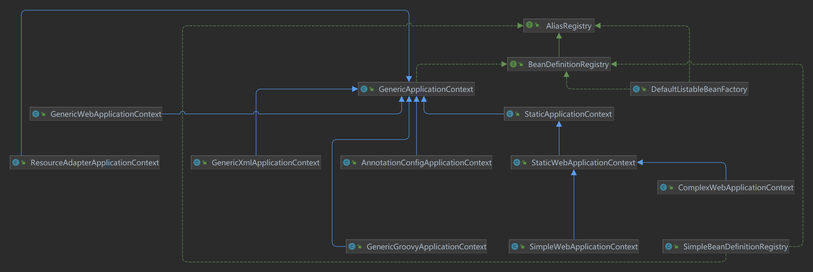

+++
title = "ClassPathBeanDefinitionScanner主流程源码解析"
date = "2023-01-25"
description = "Spring BeanDefinition模块扫描器源码解析"
tags = [
    "Spring",
    "BeanDefinition"
]
categories = [
    "Spring"
]
image = "bd.jpeg"
draft=true
+++

本篇文章主要是介绍Spring在生成BeanDefinition的过程中，涉及到的核心组件ClassPathBeanDefinitionScanner的主流程源码解析。ClassPathBeanDefinitionScanner涉及到的相关底层API使用我在另一篇博文中已经介绍过了[Spring源码BeanDefinition解析之ClassPathBeanDefinitionScanner]()
<!--more-->

## 扫描解析入口方法
Spring上下文容器在扫描时会调用`org.springframework.context.annotation.ClassPathBeanDefinitionScanner#scan`进行解析指定包路径下面的候选
定义，具体Spring是在哪调用该方法进入扫描解析流程的后续再详细分析，本篇专注解析逻辑本身。
```java{.line-numbers}
public int scan(String... basePackages) {
    // 获取已经扫描的bean定义个数
    int beanCountAtScanStart = this.registry.getBeanDefinitionCount();
    // 开始扫描解析
    doScan(basePackages);
    
    // Register annotation config processors, if necessary.
    if (this.includeAnnotationConfig) {
        AnnotationConfigUtils.registerAnnotationConfigProcessors(this.registry);
    }
    // 计算本次实际扫描解析到的bean定义个数
    return (this.registry.getBeanDefinitionCount() - beanCountAtScanStart);
}
```
scan方法中并没有核心的解析逻辑，主要做了两件事，第一件事调用doScan(basePackages)方法解析用户包路径下的自定义的BeanDefinition。第二件事就是向上下文容器中直接注册注解配置相关的处理器BeanDefinition，后续就可以直接使用这些infra组件辅助完成容器的后续初始化工作。
## 注册基础组件
Spring默认会进行基础组件BeanDefinition的手动注册，这些基础组件的BeanDefinition后续会直接实例化辅助Spring容器初始化，具体的方法逻辑如下：
```java{.line-numbers}
org.springframework.context.annotation.AnnotationConfigUtils#registerAnnotationConfigProcessors(org.springframework.beans.factory.support.BeanDefinitionRegistry, java.lang.Object)

public static Set<BeanDefinitionHolder> registerAnnotationConfigProcessors(
			BeanDefinitionRegistry registry, @Nullable Object source) {

    DefaultListableBeanFactory beanFactory = unwrapDefaultListableBeanFactory(registry);
    if (beanFactory != null) {

        // 设置beanFactory的OrderComparator为AnnotationAwareOrderComparator
        // 它是一个Comparator，是一个比较器，可以用来进行排序，比如new ArrayList<>().sort(Comparator);
        if (!(beanFactory.getDependencyComparator() instanceof AnnotationAwareOrderComparator)) {
            beanFactory.setDependencyComparator(AnnotationAwareOrderComparator.INSTANCE);
        }
        // 用来判断某个Bean能不能用来进行依赖注入
        if (!(beanFactory.getAutowireCandidateResolver() instanceof ContextAnnotationAutowireCandidateResolver)) {
            beanFactory.setAutowireCandidateResolver(new ContextAnnotationAutowireCandidateResolver());
        }
    }

    Set<BeanDefinitionHolder> beanDefs = new LinkedHashSet<>(8);

    // 注册ConfigurationClassPostProcessor类型的BeanDefinition
    if (!registry.containsBeanDefinition(CONFIGURATION_ANNOTATION_PROCESSOR_BEAN_NAME)) {
        RootBeanDefinition def = new RootBeanDefinition(ConfigurationClassPostProcessor.class);
        def.setSource(source);
        beanDefs.add(registerPostProcessor(registry, def, CONFIGURATION_ANNOTATION_PROCESSOR_BEAN_NAME));
    }

    // 注册AutowiredAnnotationBeanPostProcessor类型的BeanDefinition
    if (!registry.containsBeanDefinition(AUTOWIRED_ANNOTATION_PROCESSOR_BEAN_NAME)) {
        RootBeanDefinition def = new RootBeanDefinition(AutowiredAnnotationBeanPostProcessor.class);
        def.setSource(source);
        beanDefs.add(registerPostProcessor(registry, def, AUTOWIRED_ANNOTATION_PROCESSOR_BEAN_NAME));
    }

    // 注册CommonAnnotationBeanPostProcessor类型的BeanDefinition
    // Check for JSR-250 support, and if present add the CommonAnnotationBeanPostProcessor.
    if (jsr250Present && !registry.containsBeanDefinition(COMMON_ANNOTATION_PROCESSOR_BEAN_NAME)) {
        RootBeanDefinition def = new RootBeanDefinition(CommonAnnotationBeanPostProcessor.class);
        def.setSource(source);
        beanDefs.add(registerPostProcessor(registry, def, COMMON_ANNOTATION_PROCESSOR_BEAN_NAME));
    }

    // 注册PersistenceAnnotationBeanPostProcessor类型的BeanDefinition
    // Check for JPA support, and if present add the PersistenceAnnotationBeanPostProcessor.
    if (jpaPresent && !registry.containsBeanDefinition(PERSISTENCE_ANNOTATION_PROCESSOR_BEAN_NAME)) {
        RootBeanDefinition def = new RootBeanDefinition();
        try {
            def.setBeanClass(ClassUtils.forName(PERSISTENCE_ANNOTATION_PROCESSOR_CLASS_NAME,
                    AnnotationConfigUtils.class.getClassLoader()));
        }
        catch (ClassNotFoundException ex) {
            throw new IllegalStateException(
                    "Cannot load optional framework class: " + PERSISTENCE_ANNOTATION_PROCESSOR_CLASS_NAME, ex);
        }
        def.setSource(source);
        beanDefs.add(registerPostProcessor(registry, def, PERSISTENCE_ANNOTATION_PROCESSOR_BEAN_NAME));
    }

    // 注册EventListenerMethodProcessor类型的BeanDefinition，用来处理@EventListener注解的
    if (!registry.containsBeanDefinition(EVENT_LISTENER_PROCESSOR_BEAN_NAME)) {
        RootBeanDefinition def = new RootBeanDefinition(EventListenerMethodProcessor.class);
        def.setSource(source);
        beanDefs.add(registerPostProcessor(registry, def, EVENT_LISTENER_PROCESSOR_BEAN_NAME));
    }

    // 注册DefaultEventListenerFactory类型的BeanDefinition，用来处理@EventListener注解的
    if (!registry.containsBeanDefinition(EVENT_LISTENER_FACTORY_BEAN_NAME)) {
        RootBeanDefinition def = new RootBeanDefinition(DefaultEventListenerFactory.class);
        def.setSource(source);
        beanDefs.add(registerPostProcessor(registry, def, EVENT_LISTENER_FACTORY_BEAN_NAME));
    }

    return beanDefs;
}
```
* 第7-18行：向容器上下文中注入AnnotationAwareOrderComparator和ContextAnnotationAutowireCandidateResolver两个组件，都是跟依赖注入功能相关，第一个组件在上篇文章介绍扫描器时已经详细介绍了，这里就不赘述了，第二个组件会在解析依赖注入功能时再详细介绍。
* 第23-72行：向容器中手动设置各种类型的postProcessor后置扩展点处理器作为infra组件：
    * `org.springframework.beans.factory.config.BeanFactoryPostProcessor`：ConfigurationClassPostProcessor、EventListenerMethodProcessor
    * `org.springframework.beans.factory.config.BeanPostProcessor`：AutowiredAnnotationBeanPostProcessor、CommonAnnotationBeanPostProcessor、PersistenceAnnotationBeanPostProcessor
    * `org.springframework.context.event.EventListenerFactory`:DefaultEventListenerFactory。

这些基础的内置infra扩展点处理器后续会在容器初始化的不同生命周期阶段发挥作用，到时用到再进行详细分析。Spring在扫描用户自定义的bean前会预先调用registerPostProcessor方法进行手动注册。具体的注册逻辑又是怎样的呢？

```java
org.springframework.context.annotation.AnnotationConfigUtils#registerPostProcessor

private static BeanDefinitionHolder registerPostProcessor(
			BeanDefinitionRegistry registry, RootBeanDefinition definition, String beanName) {

    definition.setRole(BeanDefinition.ROLE_INFRASTRUCTURE);
    registry.registerBeanDefinition(beanName, definition);  // BeanDefinitinoMap
    return new BeanDefinitionHolder(definition, beanName);
}
```
这里我们先简单的看一下infra的beanDefinition注册步骤，详细的注册逻辑在后面注册用户自定义的bean时再分析。首先这些infra的组件beanDefinition会被创建成`org.springframework.beans.factory.support.RootBeanDefinition`，RootBeanDefinition是可以直接被容器拿来进行IOC的beanDefinition类型，无须再进行其他的解析处理，相当于是已经解析后的成品beanDefinition，其他类型的beanDefinition在IOC时最后都会被转换（进一步解析）成RootBeanDefinition，这些不同类型的beanDefinition我会在新的文章中详细介绍。

beanDefinition的类型会被设置ROLE_INFRASTRUCTURE表示当前bean的类型是基础组件。
* ROLE_APPLICATION：表示bean是应用组成级别的，通常用户自定义的bean会被设置成此角色
* ROLE_SUPPORT：表示bean是支持配置级别的
* ROLE_INFRASTRUCTURE：通常表示内部功能级别的bean，这些bean不会被用户使用

真正进行注册beanDefinition则是调用容器的registerBeanDefinition将definition注册到容器的BeanDefinitinoMap中去。

## 注册用户自定义beanDefinition
```java
protected Set<BeanDefinitionHolder> doScan(String... basePackages) {
    Assert.notEmpty(basePackages, "At least one base package must be specified");
    Set<BeanDefinitionHolder> beanDefinitions = new LinkedHashSet<>();
    for (String basePackage : basePackages) {

        Set<BeanDefinition> candidates = findCandidateComponents(basePackage);

        for (BeanDefinition candidate : candidates) {
            ScopeMetadata scopeMetadata = this.scopeMetadataResolver.resolveScopeMetadata(candidate);
            candidate.setScope(scopeMetadata.getScopeName());

            String beanName = this.beanNameGenerator.generateBeanName(candidate, this.registry);

            if (candidate instanceof AbstractBeanDefinition) {
                postProcessBeanDefinition((AbstractBeanDefinition) candidate, beanName);
            }
            if (candidate instanceof AnnotatedBeanDefinition) {
                // 解析@Lazy、@Primary、@DependsOn、@Role、@Description
                AnnotationConfigUtils.processCommonDefinitionAnnotations((AnnotatedBeanDefinition) candidate);
            }

            // 检查Spring容器中是否已经存在该beanName
            if (checkCandidate(beanName, candidate)) {
                BeanDefinitionHolder definitionHolder = new BeanDefinitionHolder(candidate, beanName);
                definitionHolder =
                        AnnotationConfigUtils.applyScopedProxyMode(scopeMetadata, definitionHolder, this.registry);
                beanDefinitions.add(definitionHolder);

                // 注册
                registerBeanDefinition(definitionHolder, this.registry);
            }
        }
    }
    return beanDefinitions;
}
```
* 第4-6行：扫描basePackage下的资源文件生成BeanDefinition，findCandidateComponents找出候选的BeanDefinition是核心的扫描解析逻辑，下面详细分析。
* 第9-10行：解析bean的scope属性
* 第12行：调用BeanNameGenerator给bean生成名字

## 解析资源文件生成BeanDefinition
```java
org.springframework.context.annotation.ClassPathScanningCandidateComponentProvider#findCandidateComponents

public Set<BeanDefinition> findCandidateComponents(String basePackage) {
    if (this.componentsIndex != null && indexSupportsIncludeFilters()) {
        return addCandidateComponentsFromIndex(this.componentsIndex, basePackage);
    }
    else {
        return scanCandidateComponents(basePackage);
    }
}
```
* 第4-6行：使用索引扫描BeanDefinition
* 第8行：通过扫描资源文件即用户的class文件生成BeanDefinition

### 索引扫描
TODO
### 扫描候选组件
将资源文件解析成BeanDefinition的功能主要由scanCandidateComponents方法完成。入参basePackage是包路径，返回值为解析的BeanDefinition集合。源码如下：
```java
private Set<BeanDefinition> scanCandidateComponents(String basePackage) {
    Set<BeanDefinition> candidates = new LinkedHashSet<>();
    try {
        // 获取basePackage下所有的文件资源
        String packageSearchPath = ResourcePatternResolver.CLASSPATH_ALL_URL_PREFIX +
                resolveBasePackage(basePackage) + '/' + this.resourcePattern;

        Resource[] resources = getResourcePatternResolver().getResources(packageSearchPath);

        boolean traceEnabled = logger.isTraceEnabled();
        boolean debugEnabled = logger.isDebugEnabled();
        for (Resource resource : resources) {
            if (traceEnabled) {
                logger.trace("Scanning " + resource);
            }
            if (resource.isReadable()) {
                try {
                    MetadataReader metadataReader = getMetadataReaderFactory().getMetadataReader(resource);
                    // excludeFilters、includeFilters判断
                    if (isCandidateComponent(metadataReader)) { // @Component-->includeFilters判断
                        ScannedGenericBeanDefinition sbd = new ScannedGenericBeanDefinition(metadataReader);
                        sbd.setSource(resource);

                        if (isCandidateComponent(sbd)) {
                            if (debugEnabled) {
                                logger.debug("Identified candidate component class: " + resource);
                            }
                            candidates.add(sbd);
                        }
                        else {
                            if (debugEnabled) {
                                logger.debug("Ignored because not a concrete top-level class: " + resource);
                            }
                        }
                    }
                    else {
                        if (traceEnabled) {
                            logger.trace("Ignored because not matching any filter: " + resource);
                        }
                    }
                }
                catch (Throwable ex) {
                    throw new BeanDefinitionStoreException(
                            "Failed to read candidate component class: " + resource, ex);
                }
            }
            else {
                if (traceEnabled) {
                    logger.trace("Ignored because not readable: " + resource);
                }
            }
        }
    }
    catch (IOException ex) {
        throw new BeanDefinitionStoreException("I/O failure during classpath scanning", ex);
    }
    return candidates;
}
```
* 第5-8行：拼接类路径地址，最终得到classpath*:xxx/**/*.class这样的一个类似通配符的地址，xxx是你传入的包名，可以通过@ComponentScan注解指定。getResourcePatternResolver()会获取ResourcePatternResolver进行多个资源的解析，如果扫描器设置了resourcePatternResolver就直接使用，没有则使用AnnotationConfigApplicationContext最为默认的ResourcePatternResolver进行资源解析。具体的资源解析器相关功能可参照[Spring源码BeanDefinition解析之ClassPathBeanDefinitionScanner]()这篇文章相关章节。

* 第18-20行:从MetadataReaderFactory获取MetadataReader，默认使用CachingMetadataReaderFactory，CachingMetadataReaderFactory会使用`Map<Resource, MetadataReader> metadataReaderCache`作为缓存存储Resource跟MetadataReader，Spring默认使用`org.springframework.core.type.classreading.SimpleMetadataReader`。isCandidateComponent方法使用excludeFilters、includeFilters、conditionEvaluator判断扫描到的资源文件是否匹配，includeFilters默认会匹配含有@Component的资源。过滤器和条件注解的具体使用参考[Spring源码BeanDefinition解析之ClassPathBeanDefinitionScanner]()这篇文章相关章节。

* 第21-28行：将上述步骤匹配的资源封装成`org.springframework.context.annotation.ScannedGenericBeanDefinition`，24行又有一个isCandidateComponent方法，会进一步在判断扫描得到的资源是否符合一个候选组件，符合的话最终加到candidates集合中返回出去。看下这个isCandidateComponent的主要逻辑：

```java
org.springframework.context.annotation.ClassPathScanningCandidateComponentProvider#isCandidateComponent(org.springframework.beans.factory.annotation.AnnotatedBeanDefinition)

protected boolean isCandidateComponent(AnnotatedBeanDefinition beanDefinition) {
    AnnotationMetadata metadata = beanDefinition.getMetadata();
    return (metadata.isIndependent() && (metadata.isConcrete() ||
            (metadata.isAbstract() && metadata.hasAnnotatedMethods(Lookup.class.getName()))));
}
```
这里判断符合候选组件的条件需要同时满足两个条件：
1. 候选组件是独立的类，如果是嵌套的内部类那必须是静态内部类。
2. 候选组件是具体的类，即非接口非抽象类；或者是抽象类的话，方法上必须含有Lookup注解。

scanCandidateComponents方法筛选候选组件时为什么要分两个isCandidateComponent方法判断呢而不是写在一个方法里面呢？第一个判断方法主要是进行外部的exclude和include过滤器的筛选，并不进行组件本身的属性条件筛选，第二个判断方法才针对类的自身属性进行具体的条件判断，诸如类的结构、是否为接口或抽象类等条件。***注意这两个判断方法都使用了protected关键字，是可以被子类重写的，如果你有自己的特殊扫描逻辑，可以通过重写这两个判断方法使用你自己的筛选逻辑***。

## scope属性解析
扫描解析出候选的BeanDefinition后，doScan方法会使用`org.springframework.context.annotation.ScopeMetadataResolver`解析scope相关的属性并设置到BeanDefinition中去。
```java
// 解析scope属性元数据信息
ScopeMetadata scopeMetadata = this.scopeMetadataResolver.resolveScopeMetadata(candidate);
// 设置BeanDefinition是singleton还是prototype
candidate.setScope(scopeMetadata.getScopeName());
```
这里使用ScopeMetadataResolver的实现`org.springframework.context.annotation.AnnotationScopeMetadataResolver`看下scope的元数据解析是如何实现的：
```java
org.springframework.context.annotation.AnnotationScopeMetadataResolver#resolveScopeMetadata

public ScopeMetadata resolveScopeMetadata(BeanDefinition definition) {
    ScopeMetadata metadata = new ScopeMetadata();
    if (definition instanceof AnnotatedBeanDefinition) {
        AnnotatedBeanDefinition annDef = (AnnotatedBeanDefinition) definition;
        AnnotationAttributes attributes = AnnotationConfigUtils.attributesFor(
                annDef.getMetadata(), this.scopeAnnotationType);
        if (attributes != null) {
            metadata.setScopeName(attributes.getString("value"));
            ScopedProxyMode proxyMode = attributes.getEnum("proxyMode");
            if (proxyMode == ScopedProxyMode.DEFAULT) {
                proxyMode = this.defaultProxyMode;
            }
            metadata.setScopedProxyMode(proxyMode);
        }
    }
    return metadata;
}
```
* 第6-8行：获取AnnotatedBeanDefinition的元数据信息AnnotationMetadata，通过注解工具类AnnotationConfigUtils获取Scope属性的元数据信息AnnotationAttributes，AnnotationAttributes实际上是一个LinkedHashMap<String, Object>，key就是注解中的属性名称，value就是注解中的属性值。***所以一个AnnotationAttributes实际就是一个注解的元数据信息集合***。

* 第9-16行：有了Scope属性的元数据信息，提取value值和proxyMode值设置到ScopeMetadata中。Scope注解中的proxyMode值是个枚举值，用于指定在创建代理对象时使用的代理模式，它有三种可能的取值：
    * proxyMode = ScopedProxyMode.NO：这表示不要使用代理来包装bean，直接返回原始的bean对象，如果不设置proxyMode属性，默认值就是这个。
    * proxyMode = ScopedProxyMode.INTERFACES：这表示使用JDK动态代理来包装bean，并且只暴露bean实现的接口。
    * proxyMode = ScopedProxyMode.TARGET_CLASS：这表示使用CGLIB来包装bean，并保留类的结构。

## beanName生成规则
在doScan方法中，使用`org.springframework.beans.factory.support.BeanNameGenerator#generateBeanName`生成bean的名称，BeanNameGenerator接口有多个实现，这里使用`org.springframework.context.annotation.AnnotationBeanNameGenerator`作为示例参考：
```java
org.springframework.context.annotation.AnnotationBeanNameGenerator#generateBeanName

public String generateBeanName(BeanDefinition definition, BeanDefinitionRegistry registry) {
    if (definition instanceof AnnotatedBeanDefinition) {
        // 获取注解所指定的beanName
        String beanName = determineBeanNameFromAnnotation((AnnotatedBeanDefinition) definition);
        if (StringUtils.hasText(beanName)) {
            // Explicit bean name found.
            return beanName;
        }
    }
    // Fallback: generate a unique default bean name.
    return buildDefaultBeanName(definition, registry);
}
```
* 第2-9行：如果类使用了注解配置，则使用注解方式生成beanName。
* 第11行：非注解方式定义bean，则使用默认的beanName生成规则。

### 注解方式生成beanName
如果我们使用了@Component、@Controller、@Service、@Repository这些注解定义bean，并且通过value属性显示定义了beanName,那么Spring通过determineBeanNameFromAnnotation方法解析beanName，具体逻辑如下：
```java
org.springframework.context.annotation.AnnotationBeanNameGenerator#determineBeanNameFromAnnotation

protected String determineBeanNameFromAnnotation(AnnotatedBeanDefinition annotatedDef) {
    AnnotationMetadata amd = annotatedDef.getMetadata();
    Set<String> types = amd.getAnnotationTypes();
    String beanName = null;
    for (String type : types) {
        AnnotationAttributes attributes = AnnotationConfigUtils.attributesFor(amd, type);
        if (attributes != null) {
            Set<String> metaTypes = this.metaAnnotationTypesCache.computeIfAbsent(type, key -> {
                Set<String> result = amd.getMetaAnnotationTypes(key);
                return (result.isEmpty() ? Collections.emptySet() : result);
            });
            if (isStereotypeWithNameValue(type, metaTypes, attributes)) {
                Object value = attributes.get("value");
                if (value instanceof String) {
                    String strVal = (String) value;
                    if (StringUtils.hasLength(strVal)) {
                        if (beanName != null && !strVal.equals(beanName)) {
                            throw new IllegalStateException("Stereotype annotations suggest inconsistent " +
                                    "component names: '" + beanName + "' versus '" + strVal + "'");
                        }
                        beanName = strVal;
                    }
                }
            }
        }
    }
    return beanName;
}
```
* 第2-3行：获取类上的注解元数据信息和所有的注解全限定名称
* 第6-11行：找出这些注解的属性元信息，如果注解是复合注解，比如@Service、@Controller这种那么再找出这些复合注解的元注解信息，isStereotypeWithNameValue根据这些数据判断注解中是否包含Component的信息，如果使用了@Service、@Controller、@Component注解并且value属性设置了beanName那么则直接使用。
```java
protected boolean isStereotypeWithNameValue(String annotationType,
        Set<String> metaAnnotationTypes, @Nullable Map<String, Object> attributes) {
    // 当前注解是否直接使用Component
    boolean isStereotype = annotationType.equals(COMPONENT_ANNOTATION_CLASSNAME) ||
            // 元注解中是否包含Component
            metaAnnotationTypes.contains(COMPONENT_ANNOTATION_CLASSNAME) ||
            annotationType.equals("javax.annotation.ManagedBean") ||
            annotationType.equals("javax.inject.Named");

    return (isStereotype && attributes != null && attributes.containsKey("value"));
}
```
### 默认方式生成beanName
如果没有使用注解方式定义bean或者使用了注解（@Component、@Controller、@Service、@Repository）但是没有在value属性中显示指定beanName，那么会走默认生成beanName的逻辑，源码位于`org.springframework.context.annotation.AnnotationBeanNameGenerator#buildDefaultBeanName(org.springframework.beans.factory.config.BeanDefinition)`：
```java
protected String buildDefaultBeanName(BeanDefinition definition) {
    String beanClassName = definition.getBeanClassName();
    Assert.state(beanClassName != null, "No bean class name set");
    String shortClassName = ClassUtils.getShortName(beanClassName);
    return Introspector.decapitalize(shortClassName);
}
```
* 第2-4行：获取类的名称，没有全限定名
* 第5行：真正生成beanName的方法位于`java.beans.Introspector#decapitalize`
```java
java.beans.Introspector#decapitalize

public static String decapitalize(String name) {
    if (name == null || name.length() == 0) {
        return name;
    }
    // 第一和第二个字母都是大写
    if (name.length() > 1 && Character.isUpperCase(name.charAt(1)) &&
                    Character.isUpperCase(name.charAt(0))){
        return name;
    }
    // 首字母小写
    char chars[] = name.toCharArray();
    chars[0] = Character.toLowerCase(chars[0]);
    return new String(chars);
}
```
如果是驼峰的命名方式，会把首字母转小写，比如FooBah变成fooBah，X变成x;如果首字母跟第二个字母都是大写这种，则返回原名称不会转换，比如URL还是保持URL不会转换。    

## beanDefinition后置处理
在完成beanName的生成后，扫描器会进行beanDefinition的后置处理，主要是进行一些一些属性的默认赋值和一些通用注解的解析赋值，如@Lazy、@Primary、@DependsOn、@Role、@Description。
### 属性默认赋值
doScan方法会判断当前候选组件的BeanDefinition是否为AbstractBeanDefinition，是则进行属性的默认赋值。AbstractBeanDefinition的子类有很多，RootBeanDefinition、ChildBeanDefinition、ScannedGenericBeanDefinition、AnnotatedGenericBeanDefinition这些都是。扫描器刚通过scanCandidateComponents扫出来的候选组件都是ScannedGenericBeanDefinition，所以默认会走postProcessBeanDefinition进行属性赋值。
```java
org.springframework.context.annotation.ClassPathBeanDefinitionScanner

// 如果候选组件为AbstractBeanDefinition进行属性默认值赋值
if (candidate instanceof AbstractBeanDefinition) {
    postProcessBeanDefinition((AbstractBeanDefinition) candidate, beanName);
}

// ClassPathBeanDefinitionScanner创建时默认会初始化beanDefinitionDefaults
private BeanDefinitionDefaults beanDefinitionDefaults = new BeanDefinitionDefaults();

protected void postProcessBeanDefinition(AbstractBeanDefinition beanDefinition, String beanName) {
    // 设置BeanDefinition的默认值
    beanDefinition.applyDefaults(this.beanDefinitionDefaults);

    // AutowireCandidate表示某个Bean能否被用来做依赖注入
    if (this.autowireCandidatePatterns != null) {
        beanDefinition.setAutowireCandidate(PatternMatchUtils.simpleMatch(this.autowireCandidatePatterns, beanName));
    }
}
```
* 第13行：主要就是对BeanDefinition的部分属性进行统一默认赋值，通过将ClassPathBeanDefinitionScanner的属性beanDefinitionDefaults对象中的属性赋值到候选的beanDefinition中去,ClassPathBeanDefinitionScanner创建时默认会初始化beanDefinitionDefaults，也可显示调用ClassPathBeanDefinitionScanner的setBeanDefinitionDefaults进行设置。默认都有哪些属性值呢？
```java
org.springframework.beans.factory.support.AbstractBeanDefinition#applyDefaults

public void applyDefaults(BeanDefinitionDefaults defaults) {
    // 设置lazyInit属性
    Boolean lazyInit = defaults.getLazyInit();
    if (lazyInit != null) {
        setLazyInit(lazyInit);
    }
    // 设置autowireMode属性 默认为AUTOWIRE_NO
    setAutowireMode(defaults.getAutowireMode());
    // 设置dependencyCheck属性，默认DEPENDENCY_CHECK_NONE
    setDependencyCheck(defaults.getDependencyCheck());
    // 设置bean初始化时的hook方法
    setInitMethodName(defaults.getInitMethodName());
    // 设置enforceInitMethod属性默认true
    setEnforceInitMethod(false);
    // 设置bean销毁时的hook方法
    setDestroyMethodName(defaults.getDestroyMethodName());
    // 设置enforceDestroyMethod属性 默认true
    setEnforceDestroyMethod(false);
}
```
* 第16~18行：设置autowireCandidate属性，autowireCandidate属性是用来设置自动装配候选模式的，表示当前bean是否可以被其他bean自动装配，默认为true。autowireCandidatePatterns属性是一组类似正则的匹配规则，允许你指定一组模式，用于匹配bean的名称，以确定哪些bean应该被视为自动装配的候选bean。比如autowireCandidatePatterns设置为[*Service],那些名称以Service结尾的bean会被考虑为自动装配的候选项，如果当前bean是userService，autowireCandidate属性会被设置成true。simpleMatch方法还能匹配其他诸如"xxx*", "*xxx*","xxx*yyy"的模式。

### AnnotatedBeanDefinition注解解析
扫描器扫描解析出的候选组件为AnnotatedBeanDefinition类型，会进行@Lazy、@Primary、@DependsOn、@Role、@Description属性的值解析，代码比较简单：
```java
static void processCommonDefinitionAnnotations(AnnotatedBeanDefinition abd, AnnotatedTypeMetadata metadata) {
    // 解析Lazy注解
    AnnotationAttributes lazy = attributesFor(metadata, Lazy.class);
    if (lazy != null) {
        abd.setLazyInit(lazy.getBoolean("value"));
    }
    else if (abd.getMetadata() != metadata) {
        lazy = attributesFor(abd.getMetadata(), Lazy.class);
        if (lazy != null) {
            abd.setLazyInit(lazy.getBoolean("value"));
        }
    }
    // 解析Primary
    if (metadata.isAnnotated(Primary.class.getName())) {
        abd.setPrimary(true);
    }
    // 解析DependsOn
    AnnotationAttributes dependsOn = attributesFor(metadata, DependsOn.class);
    if (dependsOn != null) {
        abd.setDependsOn(dependsOn.getStringArray("value"));
    }
    // 解析Role
    AnnotationAttributes role = attributesFor(metadata, Role.class);
    if (role != null) {
        abd.setRole(role.getNumber("value").intValue());
    }
    // 解析Description
    AnnotationAttributes description = attributesFor(metadata, Description.class);
    if (description != null) {
        abd.setDescription(description.getString("value"));
    }
}
```
## 注册beanDefinition
&ensp;&ensp;&ensp;&ensp;在完成了上面的资源文件扫描解析、属性初始化赋值解析、beanName生成等步骤后，扫描器才开始进行真正的beanDefinition注册。在开始之前，Spring首先会根据beanName检测容器中是否已经注册过了相应的bean，没有就进行注册，如果检测到容器中已经有了呢，对于名称冲突的bean该具体如何处理呢？ClassPathBeanDefinitionScanner#checkCandidate方法中给出了具体的答案：
```java
protected boolean checkCandidate(String beanName, BeanDefinition beanDefinition) throws IllegalStateException {
    // 容器中没有当前beanName，返回true，后续开始真正的注册beanDefinition步骤
    if (!this.registry.containsBeanDefinition(beanName)) {
        return true;
    }
    // 获取容器中已经存在的冲突的BeanDefinition
    BeanDefinition existingDef = this.registry.getBeanDefinition(beanName);
    BeanDefinition originatingDef = existingDef.getOriginatingBeanDefinition();
    if (originatingDef != null) {
        existingDef = originatingDef;
    }
    // 是否兼容，如果兼容返回false表示不会重新注册到Spring容器中，如果不冲突则会抛异常。
    if (isCompatible(beanDefinition, existingDef)) {
        return false;
    }
    throw new ConflictingBeanDefinitionException("Annotation-specified bean name '" + beanName +
            "' for bean class [" + beanDefinition.getBeanClassName() + "] conflicts with existing, " +
            "non-compatible bean definition of same name and class [" + existingDef.getBeanClassName() + "]");
}
```
&ensp;&ensp;&ensp;&ensp;checkCandidate方法中，通过beanName查看容器中是否已经存在注册过了的beanDefinition，没有注册就对外返回false，后续进行真正的beanDefinition步骤实现。  
&ensp;&ensp;&ensp;&ensp;如果检测到已经存在相同beanName的冲突的bean，isCompatible方法进行兼容判断，不兼容，Spring就抛出ConflictingBeanDefinitionException运行时异常中断Spring的启动，告诉用户具体的冲突bean的类名称进行检查处理。  
&ensp;&ensp;&ensp;&ensp;如果需要兼容，checkCandidate方法返回false,使用新的beanDefinition注册以覆盖先前注册过的beanDefinition。
### 兼容判断冲突的bean
```java
protected boolean isCompatible(BeanDefinition newDefinition, BeanDefinition existingDefinition) {
    return (!(existingDefinition instanceof ScannedGenericBeanDefinition) ||  // explicitly registered overriding bean
            (newDefinition.getSource() != null && newDefinition.getSource().equals(existingDefinition.getSource())) ||  // scanned same file twice
            newDefinition.equals(existingDefinition));  // scanned equivalent class twice
}
```
&ensp;&ensp;&ensp;&ensp;isCompatible方法主要通过三个条件判断是否兼容,任意满足其中一个就进行兼容。
* !(existingDefinition instanceof ScannedGenericBeanDefinition)：现有的bean定义不是沟通过扫描机制得到的,比如手动注册的,那么第二次注册时就进行兼容,使用扫描得到的beanDefinition覆盖。Spring会保证扫描的bean定义优先级高于手动的。
* newDefinition.getSource() != null && newDefinition.getSource().equals(existingDefinition.getSource())：两次扫描的资源文件是一样的第二次覆盖第一次
* newDefinition.equals(existingDefinition)：扫描了bean Class两次。
### BeanDefinitionHolder注册
经过兼容判断后,确实需要进行注册bean定义则执行如下逻辑：
```java
    // 创建BeanDefinitionHolder
    BeanDefinitionHolder definitionHolder = new BeanDefinitionHolder(candidate, beanName);
    definitionHolder =
            AnnotationConfigUtils.applyScopedProxyMode(scopeMetadata, definitionHolder, this.registry);
    beanDefinitions.add(definitionHolder);

    // 注册
    registerBeanDefinition(definitionHolder, this.registry);
```
* 第2行：使用扫描得到的BeanDefinition和beanName创建BeanDefinitionHolder。BeanDefinitionHolder具体是什么呢？
* 第3~4行：如果bean指定了@Scope中的proxyMode属性为ScopedProxyMode.INTERFACES或ScopedProxyMode.TARGET_CLASS,需要对BeanDefinition做一些特殊处理设置。
* 第5行：加入扫描的bean定义集合Set中去对外返回
* 第8行：使用definitionHolder进行真正的注册bean定义。
#### BeanDefinitionHolder
Spring对bean定义既然已经定义了父接口`BeanDefinition`,为啥不直接使用BeanDefinition进行注册呢,还要再wrap一个BeanDefinitionHolder进行注册呢？

```java
public class BeanDefinitionHolder implements BeanMetadataElement {

	private final BeanDefinition beanDefinition;

	private final String beanName;

	@Nullable
	private final String[] aliases;

    ...
}
```
看下BeanDefinitionHolder的属性其实是对BeanDefinition的wrap,它持有BeanDefinition和beanName,而且多了一个别名的属性,允许bean拥有多个别名。


#### BeanDefinitionRegistry注册bean定义
&ensp;&ensp;&ensp;&ensp;解析器中最终实现的注册的组件就是通过`BeanDefinitionRegistry#registerBeanDefinition`完成的,这就是bean定义的容器。看下BeanDefinitionRegistry接口的定义：
```java
public interface BeanDefinitionRegistry extends AliasRegistry {

	// 使用beanName和beanDefinition进行注册
	void registerBeanDefinition(String beanName, BeanDefinition beanDefinition)
			throws BeanDefinitionStoreException;

	// 删除指定beanName的bean定义
	void removeBeanDefinition(String beanName) throws NoSuchBeanDefinitionException;

    // 获取指定beanName的bean定义
	BeanDefinition getBeanDefinition(String beanName) throws NoSuchBeanDefinitionException;

	// 检查是否包含指定的bean定义
	boolean containsBeanDefinition(String beanName);

	// 返回所有注册bean定义的beanName
	String[] getBeanDefinitionNames();

	// 返回注册bean定义个数
	int getBeanDefinitionCount();

	// beanName是否被使用了
	boolean isBeanNameInUse(String beanName);
}

public interface AliasRegistry {

	// 使用beanName和alias注册
	void registerAlias(String name, String alias);

	// 删除指定别名的bean
	void removeAlias(String alias);

	// 给定的beanName是否是别名
	boolean isAlias(String name);

	// 获取beanName的别名
	String[] getAliases(String name);

}
```
&ensp;&ensp;&ensp;&ensp;BeanDefinitionRegistry继承了父接口AliasRegistry,这两个接口据中定义了使用beanName、alias进行bean的增删查等一系列方法。
Spring中的具体实现有哪些呢？
 
&ensp;&ensp;&ensp;&ensp;大部分的高级容器都实现了这两个接口,那么注册到扫描器中的BeanDefinitionRegistry具体实现又是什么呢？
```java
public AnnotationConfigApplicationContext() {
    StartupStep createAnnotatedBeanDefReader = this.getApplicationStartup().start("spring.context.annotated-bean-reader.create");
    // 额外会创建StandardEnvironment
    this.reader = new AnnotatedBeanDefinitionReader(this);
    createAnnotatedBeanDefReader.end();
    // 将AnnotationConfigApplicationContext上下文作为bean定义容器
    this.scanner = new ClassPathBeanDefinitionScanner(this);
}

// ClassPathBeanDefinitionScanner扫描器构造函数
public ClassPathBeanDefinitionScanner(BeanDefinitionRegistry registry, boolean useDefaultFilters,
			Environment environment, @Nullable ResourceLoader resourceLoader) {

    Assert.notNull(registry, "BeanDefinitionRegistry must not be null");
    // 构造函数传入bean定义容器
    this.registry = registry;

    if (useDefaultFilters) {
        registerDefaultFilters();
    }
    setEnvironment(environment);
    setResourceLoader(resourceLoader);
}
```
&ensp;&ensp;&ensp;&ensp;Spring在初始化上下文时将自身AnnotationConfigApplicationContext作为registry设置到了扫描器中去。   
既然弄清楚了registry的具体实现,在回到doScan方法中看具体的注册实现源码：

```java
org.springframework.context.annotation.ClassPathBeanDefinitionScanner#doScan

protected Set<BeanDefinitionHolder> doScan(String... basePackages){
    if (checkCandidate(beanName, candidate)){
        // 注册bean定义
        registerBeanDefinition(definitionHolder, this.registry);
    }
}

protected void registerBeanDefinition(BeanDefinitionHolder definitionHolder, BeanDefinitionRegistry registry) {
    BeanDefinitionReaderUtils.registerBeanDefinition(definitionHolder, registry);
}

org.springframework.beans.factory.support.BeanDefinitionReaderUtils#registerBeanDefinition

public static void registerBeanDefinition(
        BeanDefinitionHolder definitionHolder, BeanDefinitionRegistry registry)
        throws BeanDefinitionStoreException {

    // 使用beanName注册
    String beanName = definitionHolder.getBeanName();
    registry.registerBeanDefinition(beanName, definitionHolder.getBeanDefinition());

    // 如果存在别名使用别名注册
    String[] aliases = definitionHolder.getAliases();
    if (aliases != null) {
        for (String alias : aliases) {
            registry.registerAlias(beanName, alias);
        }
    }
}
```
* 第8~9行：使用beanName和beanDefinition注册到registry中去。
* 第12~17行：如果bean存在别名,则将beanName和别名也注册到registry中。    
&ensp;&ensp;&ensp;&ensp;知道了registry的真正实现是AnnotationConfigApplicationContext,那么看下registerBeanDefinition的具体实现：
```java
org.springframework.context.support.GenericApplicationContext#registerBeanDefinition

private final DefaultListableBeanFactory beanFactory;

public void registerBeanDefinition(String beanName, BeanDefinition beanDefinition)
			throws BeanDefinitionStoreException {
    // 具体注册委托给了DefaultListableBeanFactory
	this.beanFactory.registerBeanDefinition(beanName, beanDefinition);
}
```
AnnotationConfigApplicationContext并没有直接实现BeanDefinitionRegistry#registerBeanDefinition方法,而是继承了父类GenericApplicationContext#registerBeanDefinition,在GenericApplicationContext#registerBeanDefinition真正的实现逻辑委托给了低级容器DefaultListableBeanFactory进行实现。
#### DefaultListableBeanFactory注册bean定义
 
```java
// key为beanName value为BeanDefinition
private final Map<String, BeanDefinition> beanDefinitionMap = new ConcurrentHashMap<>(256);

private volatile List<String> beanDefinitionNames = new ArrayList<>(256);

public void registerBeanDefinition(String beanName, BeanDefinition beanDefinition)
			throws BeanDefinitionStoreException {

    if (beanDefinition instanceof AbstractBeanDefinition) {
        try {
            ((AbstractBeanDefinition) beanDefinition).validate();
        }
        catch (BeanDefinitionValidationException ex) {
            throw new BeanDefinitionStoreException(beanDefinition.getResourceDescription(), beanName,
                    "Validation of bean definition failed", ex);
        }
    }

    BeanDefinition existingDefinition = this.beanDefinitionMap.get(beanName);
    if (existingDefinition != null) {
        // 默认是允许BeanDefinition覆盖的
        ...
        this.beanDefinitionMap.put(beanName, beanDefinition);
    }
    else {
        if (hasBeanCreationStarted()) {
            // Cannot modify startup-time collection elements anymore (for stable iteration)
            synchronized (this.beanDefinitionMap) {
                this.beanDefinitionMap.put(beanName, beanDefinition);
                List<String> updatedDefinitions = new ArrayList<>(this.beanDefinitionNames.size() + 1);
                updatedDefinitions.addAll(this.beanDefinitionNames);
                updatedDefinitions.add(beanName);
                this.beanDefinitionNames = updatedDefinitions;
                removeManualSingletonName(beanName);
            }
        }
        else {
            // Still in startup registration phase
            this.beanDefinitionMap.put(beanName, beanDefinition);
            this.beanDefinitionNames.add(beanName);
            removeManualSingletonName(beanName);
        }
      ...
    }
    ...
}
```
* 第4~12行：bean定义校验,主要对bean需要重写的方法进行校验和预处理。
* 第14~19行：beanDefinitionMap中已经注册过了,默认进行覆盖注册
* 第26~42行：往beanDefinitionMap、beanDefinitionNames添加新的bean

bean定义的注册整个流程的细节还是有点复杂的,这里简化了逻辑,只分析了核心部分代码。注册的核心就是往beanDefinitionMap、beanDefinitionNames新增了新的bean的相关信息。