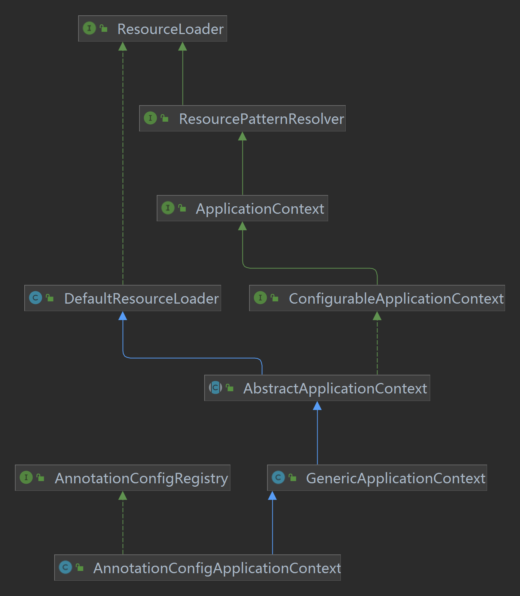

+++
title = "ClassPathBeanDefinitionScanner主流程源码解析"
date = "2023-01-25"
description = "Spring BeanDefinition模块扫描器源码解析"
tags = [
    "Spring",
    "BeanDefinition"
]
categories = [
    "Spring"
]
image = "bd.jpeg"
draft=true
+++

本篇文章主要是介绍Spring在生成BeanDefinition的过程中，涉及到的核心组件ClassPathBeanDefinitionScanner的主流程源码解析。ClassPathBeanDefinitionScanner涉及到的相关底层API使用我在另一篇博文中已经介绍过了[Spring源码BeanDefinition解析之ClassPathBeanDefinitionScanner]()
<!--more-->

## 扫描解析入口方法
Spring上下文容器在扫描时会调用`org.springframework.context.annotation.ClassPathBeanDefinitionScanner#scan`进行解析指定包路径下面的候选
定义，具体Spring是在哪调用该方法进入扫描解析流程的后续再详细分析，本篇专注解析逻辑本身。
```java{.line-numbers}
public int scan(String... basePackages) {
    // 获取已经扫描的bean定义个数
    int beanCountAtScanStart = this.registry.getBeanDefinitionCount();
    // 开始扫描解析
    doScan(basePackages);
    
    // Register annotation config processors, if necessary.
    if (this.includeAnnotationConfig) {
        AnnotationConfigUtils.registerAnnotationConfigProcessors(this.registry);
    }
    // 计算本次实际扫描解析到的bean定义个数
    return (this.registry.getBeanDefinitionCount() - beanCountAtScanStart);
}
```
scan方法中并没有核心的解析逻辑，主要做了两件事，第一件事调用doScan(basePackages)方法解析用户包路径下的自定义的BeanDefinition。第二件事就是向上下文容器中直接注册注解配置相关的处理器BeanDefinition，后续就可以直接使用这些infra组件辅助完成容器的后续初始化工作。
## 注册基础组件
Spring默认会进行基础组件BeanDefinition的手动注册，这些基础组件的BeanDefinition后续会直接实例化辅助Spring容器初始化，具体的方法逻辑如下：
```java{.line-numbers}
org.springframework.context.annotation.AnnotationConfigUtils#registerAnnotationConfigProcessors(org.springframework.beans.factory.support.BeanDefinitionRegistry, java.lang.Object)

public static Set<BeanDefinitionHolder> registerAnnotationConfigProcessors(
			BeanDefinitionRegistry registry, @Nullable Object source) {

    DefaultListableBeanFactory beanFactory = unwrapDefaultListableBeanFactory(registry);
    if (beanFactory != null) {

        // 设置beanFactory的OrderComparator为AnnotationAwareOrderComparator
        // 它是一个Comparator，是一个比较器，可以用来进行排序，比如new ArrayList<>().sort(Comparator);
        if (!(beanFactory.getDependencyComparator() instanceof AnnotationAwareOrderComparator)) {
            beanFactory.setDependencyComparator(AnnotationAwareOrderComparator.INSTANCE);
        }
        // 用来判断某个Bean能不能用来进行依赖注入
        if (!(beanFactory.getAutowireCandidateResolver() instanceof ContextAnnotationAutowireCandidateResolver)) {
            beanFactory.setAutowireCandidateResolver(new ContextAnnotationAutowireCandidateResolver());
        }
    }

    Set<BeanDefinitionHolder> beanDefs = new LinkedHashSet<>(8);

    // 注册ConfigurationClassPostProcessor类型的BeanDefinition
    if (!registry.containsBeanDefinition(CONFIGURATION_ANNOTATION_PROCESSOR_BEAN_NAME)) {
        RootBeanDefinition def = new RootBeanDefinition(ConfigurationClassPostProcessor.class);
        def.setSource(source);
        beanDefs.add(registerPostProcessor(registry, def, CONFIGURATION_ANNOTATION_PROCESSOR_BEAN_NAME));
    }

    // 注册AutowiredAnnotationBeanPostProcessor类型的BeanDefinition
    if (!registry.containsBeanDefinition(AUTOWIRED_ANNOTATION_PROCESSOR_BEAN_NAME)) {
        RootBeanDefinition def = new RootBeanDefinition(AutowiredAnnotationBeanPostProcessor.class);
        def.setSource(source);
        beanDefs.add(registerPostProcessor(registry, def, AUTOWIRED_ANNOTATION_PROCESSOR_BEAN_NAME));
    }

    // 注册CommonAnnotationBeanPostProcessor类型的BeanDefinition
    // Check for JSR-250 support, and if present add the CommonAnnotationBeanPostProcessor.
    if (jsr250Present && !registry.containsBeanDefinition(COMMON_ANNOTATION_PROCESSOR_BEAN_NAME)) {
        RootBeanDefinition def = new RootBeanDefinition(CommonAnnotationBeanPostProcessor.class);
        def.setSource(source);
        beanDefs.add(registerPostProcessor(registry, def, COMMON_ANNOTATION_PROCESSOR_BEAN_NAME));
    }

    // 注册PersistenceAnnotationBeanPostProcessor类型的BeanDefinition
    // Check for JPA support, and if present add the PersistenceAnnotationBeanPostProcessor.
    if (jpaPresent && !registry.containsBeanDefinition(PERSISTENCE_ANNOTATION_PROCESSOR_BEAN_NAME)) {
        RootBeanDefinition def = new RootBeanDefinition();
        try {
            def.setBeanClass(ClassUtils.forName(PERSISTENCE_ANNOTATION_PROCESSOR_CLASS_NAME,
                    AnnotationConfigUtils.class.getClassLoader()));
        }
        catch (ClassNotFoundException ex) {
            throw new IllegalStateException(
                    "Cannot load optional framework class: " + PERSISTENCE_ANNOTATION_PROCESSOR_CLASS_NAME, ex);
        }
        def.setSource(source);
        beanDefs.add(registerPostProcessor(registry, def, PERSISTENCE_ANNOTATION_PROCESSOR_BEAN_NAME));
    }

    // 注册EventListenerMethodProcessor类型的BeanDefinition，用来处理@EventListener注解的
    if (!registry.containsBeanDefinition(EVENT_LISTENER_PROCESSOR_BEAN_NAME)) {
        RootBeanDefinition def = new RootBeanDefinition(EventListenerMethodProcessor.class);
        def.setSource(source);
        beanDefs.add(registerPostProcessor(registry, def, EVENT_LISTENER_PROCESSOR_BEAN_NAME));
    }

    // 注册DefaultEventListenerFactory类型的BeanDefinition，用来处理@EventListener注解的
    if (!registry.containsBeanDefinition(EVENT_LISTENER_FACTORY_BEAN_NAME)) {
        RootBeanDefinition def = new RootBeanDefinition(DefaultEventListenerFactory.class);
        def.setSource(source);
        beanDefs.add(registerPostProcessor(registry, def, EVENT_LISTENER_FACTORY_BEAN_NAME));
    }

    return beanDefs;
}
```
* 第7-18行：向容器上下文中注入AnnotationAwareOrderComparator和ContextAnnotationAutowireCandidateResolver两个组件，都是跟依赖注入功能相关，第一个组件在上篇文章介绍扫描器时已经详细介绍了，这里就不赘述了，第二个组件会在解析依赖注入功能时再详细介绍。
* 第23-72行：向容器中手动设置各种类型的postProcessor后置扩展点处理器作为infra组件：
    * `org.springframework.beans.factory.config.BeanFactoryPostProcessor`：ConfigurationClassPostProcessor、EventListenerMethodProcessor
    * `org.springframework.beans.factory.config.BeanPostProcessor`：AutowiredAnnotationBeanPostProcessor、CommonAnnotationBeanPostProcessor、PersistenceAnnotationBeanPostProcessor
    * `org.springframework.context.event.EventListenerFactory`:DefaultEventListenerFactory。

这些基础的内置infra扩展点处理器后续会在容器初始化的不同生命周期阶段发挥作用，到时用到再进行详细分析。Spring在扫描用户自定义的bean前会预先调用registerPostProcessor方法进行手动注册。具体的注册逻辑又是怎样的呢？

```java
org.springframework.context.annotation.AnnotationConfigUtils#registerPostProcessor

private static BeanDefinitionHolder registerPostProcessor(
			BeanDefinitionRegistry registry, RootBeanDefinition definition, String beanName) {

    definition.setRole(BeanDefinition.ROLE_INFRASTRUCTURE);
    registry.registerBeanDefinition(beanName, definition);  // BeanDefinitinoMap
    return new BeanDefinitionHolder(definition, beanName);
}
```
这里我们先简单的看一下infra的beanDefinition注册步骤，详细的注册逻辑在后面注册用户自定义的bean时再分析。首先这些infra的组件beanDefinition会被创建成`org.springframework.beans.factory.support.RootBeanDefinition`，RootBeanDefinition是可以直接被容器拿来进行IOC的beanDefinition类型，无须再进行其他的解析处理，相当于是已经解析后的成品beanDefinition，其他类型的beanDefinition在IOC时最后都会被转换（进一步解析）成RootBeanDefinition，这些不同类型的beanDefinition我会在新的文章中详细介绍。

beanDefinition的类型会被设置ROLE_INFRASTRUCTURE表示当前bean的类型是基础组件。
* ROLE_APPLICATION：表示bean是应用组成级别的，通常用户自定义的bean会被设置成此角色
* ROLE_SUPPORT：表示bean是支持配置级别的
* ROLE_INFRASTRUCTURE：通常表示内部功能级别的bean，这些bean不会被用户使用

真正进行注册beanDefinition则是调用容器的registerBeanDefinition将definition注册到容器的BeanDefinitinoMap中去。

## 注册用户自定义beanDefinition
```java
protected Set<BeanDefinitionHolder> doScan(String... basePackages) {
    Assert.notEmpty(basePackages, "At least one base package must be specified");
    Set<BeanDefinitionHolder> beanDefinitions = new LinkedHashSet<>();
    for (String basePackage : basePackages) {

        Set<BeanDefinition> candidates = findCandidateComponents(basePackage);

        for (BeanDefinition candidate : candidates) {
            ScopeMetadata scopeMetadata = this.scopeMetadataResolver.resolveScopeMetadata(candidate);
            candidate.setScope(scopeMetadata.getScopeName());

            String beanName = this.beanNameGenerator.generateBeanName(candidate, this.registry);

            if (candidate instanceof AbstractBeanDefinition) {
                postProcessBeanDefinition((AbstractBeanDefinition) candidate, beanName);
            }
            if (candidate instanceof AnnotatedBeanDefinition) {
                // 解析@Lazy、@Primary、@DependsOn、@Role、@Description
                AnnotationConfigUtils.processCommonDefinitionAnnotations((AnnotatedBeanDefinition) candidate);
            }

            // 检查Spring容器中是否已经存在该beanName
            if (checkCandidate(beanName, candidate)) {
                BeanDefinitionHolder definitionHolder = new BeanDefinitionHolder(candidate, beanName);
                definitionHolder =
                        AnnotationConfigUtils.applyScopedProxyMode(scopeMetadata, definitionHolder, this.registry);
                beanDefinitions.add(definitionHolder);

                // 注册
                registerBeanDefinition(definitionHolder, this.registry);
            }
        }
    }
    return beanDefinitions;
}
```
第4-6行：扫描basePackage下的资源文件生成BeanDefinition，findCandidateComponents是核心的扫描解析逻辑，下面详细分析。
第9-10行：解析bean的scope属性
第12行：调用BeanNameGenerator给bean生成名字

## 解析资源文件生成BeanDefinition
```java
org.springframework.context.annotation.ClassPathScanningCandidateComponentProvider#findCandidateComponents

public Set<BeanDefinition> findCandidateComponents(String basePackage) {
    if (this.componentsIndex != null && indexSupportsIncludeFilters()) {
        return addCandidateComponentsFromIndex(this.componentsIndex, basePackage);
    }
    else {
        return scanCandidateComponents(basePackage);
    }
}
```
第4-6行：使用索引扫描BeanDefinition
第8行：通过扫描资源文件即用户的class文件生成BeanDefinition

### 索引扫描
TODO
### 扫描候选的BeanDefinition
```java
private Set<BeanDefinition> scanCandidateComponents(String basePackage) {
    Set<BeanDefinition> candidates = new LinkedHashSet<>();
    try {
        // 获取basePackage下所有的文件资源
        String packageSearchPath = ResourcePatternResolver.CLASSPATH_ALL_URL_PREFIX +
                resolveBasePackage(basePackage) + '/' + this.resourcePattern;

        Resource[] resources = getResourcePatternResolver().getResources(packageSearchPath);

        boolean traceEnabled = logger.isTraceEnabled();
        boolean debugEnabled = logger.isDebugEnabled();
        for (Resource resource : resources) {
            if (traceEnabled) {
                logger.trace("Scanning " + resource);
            }
            if (resource.isReadable()) {
                try {
                    MetadataReader metadataReader = getMetadataReaderFactory().getMetadataReader(resource);
                    // excludeFilters、includeFilters判断
                    if (isCandidateComponent(metadataReader)) { // @Component-->includeFilters判断
                        ScannedGenericBeanDefinition sbd = new ScannedGenericBeanDefinition(metadataReader);
                        sbd.setSource(resource);

                        if (isCandidateComponent(sbd)) {
                            if (debugEnabled) {
                                logger.debug("Identified candidate component class: " + resource);
                            }
                            candidates.add(sbd);
                        }
                        else {
                            if (debugEnabled) {
                                logger.debug("Ignored because not a concrete top-level class: " + resource);
                            }
                        }
                    }
                    else {
                        if (traceEnabled) {
                            logger.trace("Ignored because not matching any filter: " + resource);
                        }
                    }
                }
                catch (Throwable ex) {
                    throw new BeanDefinitionStoreException(
                            "Failed to read candidate component class: " + resource, ex);
                }
            }
            else {
                if (traceEnabled) {
                    logger.trace("Ignored because not readable: " + resource);
                }
            }
        }
    }
    catch (IOException ex) {
        throw new BeanDefinitionStoreException("I/O failure during classpath scanning", ex);
    }
    return candidates;
}
```
第5-8行：拼接类路径地址，最终得到classpath*:xxx/**/*.class这样的一个类似通配符的地址，xxx是你传入的包名，可以通过@ComponentScan注解指定。得到地址后使用`org.springframework.context.annotation.ClassPathScanningCandidateComponentProvider#resourcePatternResolver`进行资源文件解析得到`org.springframework.core.io.Resource`集合。
第18-35行:从MetadataReaderFactory获取MetadataReader，使用excludeFilters、includeFilters判断扫描到的资源文件是否需要解析成beanDefinition。

第8行最终会调用`org.springframework.core.io.support.PathMatchingResourcePatternResolver#getResources`，但是这里并不是直接使用。扫描器会使用容器上下文AnnotationConfigApplicationContext作为resourcePatternResolver。
```java
org.springframework.context.annotation.ClassPathScanningCandidateComponentProvider

// AnnotationConfigApplicationContext
private ResourcePatternResolver resourcePatternResolver;

private ResourcePatternResolver getResourcePatternResolver() {
    // 扫描器没有resourcePatternResolver 直接创建PathMatchingResourcePatternResolver
    if (this.resourcePatternResolver == null) {
        this.resourcePatternResolver = new PathMatchingResourcePatternResolver();
    }
    // 使用AnnotationConfigApplicationContext作为resourcePatternResolver
    return this.resourcePatternResolver;
}
```
 


## scope属性解析
## beanName生成
