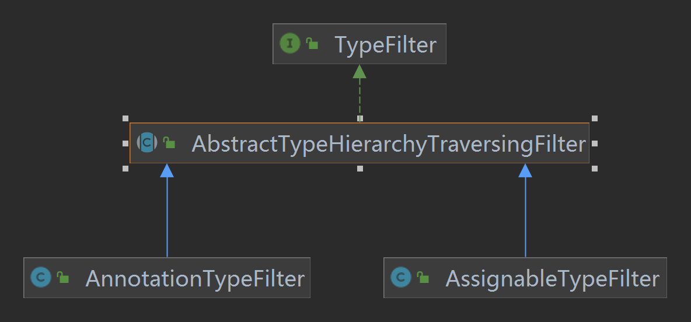

+++
title = "Spring BeanDefinition解析之ClassPathBeanDefinitionScanner"
date = "2023-01-19"
description = "Spring BeanDefinition源码解析"
tags = [
    "Spring",
    "BeanDefinition"
]
categories = [
    "Spring"
]
image = "bd.jpeg"
draft=false
+++

主要是介绍Spring framework中在解析BeanDefinition模块时用到的ClassPathBeanDefinitionScanner组件以及涉及的一些底层API。
<!--more-->

## 前言
在Spring中我们可以通过编程式的方式显示声明定义BeanDefinition：
```java
// 创建一个Spring容器
AnnotationConfigApplicationContext applicationContext = new AnnotationConfigApplicationContext(AppConfig.class);
// 获取容器中名为userService的BeanDefinition
BeanDefinition userService = applicationContext.getBeanDefinition("userService");
System.out.println(userService);
```

## ClassPathBeanDefinitionScanner
### 扫描器是什么
>bean定义扫描解析器用于在classpath下发现候选的bean,使用指定的**BeanFactory**或者**ApplicationContext**注册bean定义`BeanDefinition`。

上面是官方源码中的注释，其实写的很清楚了，扫描器通过入参classpath使用容器进行bean定义的注册，使用相关的filter进行过滤注册，默认过滤器会对包含如下注解的类进行扫描解析:
* `org.springframework.stereotype.Component @Component`
* `org.springframework.stereotype.Repository @Repository`
* `org.springframework.stereotype.Service @Service`
* `org.springframework.stereotype.Con--troller @Controller`

看下相关的构造函数API：
```java
// 构造函数中传入容器
public ClassPathBeanDefinitionScanner(BeanDefinitionRegistry registry) {
        // 使用默认过滤器
        this(registry, true);
}

// 构造函数传入容器和是否使用默认过滤器
public ClassPathBeanDefinitionScanner(BeanDefinitionRegistry registry, boolean useDefaultFilters) {
    this(registry, useDefaultFilters, getOrCreateEnvironment(registry));
}
```
扫描器根据指定的包路径比如在@ComponentScan注解中指定，通过资源解析器`ResourcePatternResolver`扫描该路径下的class文件,最终通过元数据读取器`MetadataReader`解析成一个一个的BeanDefinition注册到容器上下文中去，解析时候可以设置相应的规则filter,比如设置哪些class文件不需要解析又有哪些需要。


## ResourceLoader
### Spring中如何读取资源文件
```java
// 读取文件资源
AnnotationConfigApplicationContext ctx = new AnnotationConfigApplicationContext(AppConfig.class);
Resource resource = ctx.getResource("file://D:\\githu\\spring-framework-5.3.10\\tuling\\src\\main\\java\\com\\demo\\service\\UserService.java");
System.out.println(resource.contentLength());
System.out.println(resource.getFilename());

// 读取网络资源
Resource resource1 = ctx.getResource("https://www.baidu.com");
System.out.println(resource1.contentLength());
System.out.println(resource1.getURL());

// 读取类路径资源
Resource resource2 = ctx.getResource("classpath:spring.xml");
System.out.println(resource2.contentLength());
System.out.println(resource2.getURL());
```
容器上下文AnnotationConfigApplicationContext会根据不同的schema读取不同类型的资源，读取资源的方法一共有2个，org.springframework.context.support.GenericApplicationContext#getResource和org.springframework.context.support.GenericApplicationContext#getResources,前者读取一个而后者可以读取多个资源。

### 读取单个资源
 
这里截取了AnnotationConfigApplicationContext的资源相关接口的继承图，最顶层的接口`org.springframework.core.io.ResourceLoader`：
```java
public interface ResourceLoader {

	/** 类路径前缀: "classpath:". */
	String CLASSPATH_URL_PREFIX = ResourceUtils.CLASSPATH_URL_PREFIX;

	// 读取单个资源
	Resource getResource(String location);

	@Nullable
	ClassLoader getClassLoader();
}
```
ResourceLoader接口定义了读取单个资源的方法getResource。AnnotationConfigApplicationContext并没有覆写getResource方法，继承了父类的GenericApplicationContext#getResource:
```java
public Resource getResource(String location) {
    if (this.resourceLoader != null) {
        return this.resourceLoader.getResource(location);
    }
    return super.getResource(location);
}
```
GenericApplicationContext其实也没有具体实现getResource方法，先判断是否自定义了resourceLoader，如果已经设置了则直接调用resourceLoader.getResource读取资源；如果没有则进一步调用父类DefaultResourceLoader#getResource方法。DefaultResourceLoader才是ResourceLoader接口的具体实现：
```java
org.springframework.core.io.DefaultResourceLoader#getResource

public Resource getResource(String location) {
    Assert.notNull(location, "Location must not be null");

    for (ProtocolResolver protocolResolver : getProtocolResolvers()) {
        Resource resource = protocolResolver.resolve(location, this);
        if (resource != null) {
            return resource;
        }
    }

    if (location.startsWith("/")) {
        return getResourceByPath(location);
    }
    else if (location.startsWith(CLASSPATH_URL_PREFIX)) {
        return new ClassPathResource(location.substring(CLASSPATH_URL_PREFIX.length()), getClassLoader());
    }
    else {
        try {
            // Try to parse the location as a URL...
            URL url = new URL(location);
            return (ResourceUtils.isFileURL(url) ? new FileUrlResource(url) : new UrlResource(url));
        }
        catch (MalformedURLException ex) {
            // No URL -> resolve as resource path.
            return getResourceByPath(location);
        }
    }
}
```
第6-11行：自定义的`org.springframework.core.io.ProtocolResolver`资源协议解析器集合，Spring并没有默认实现，需要用户自己实现接口。当Spring中的默认资源解析器DefaultResourceLoader不满足资源解析条件时，可以自定义资源解析器作为扩展点，优点就是不需要实现ResourceLoader接口或者继承其他ResourceLoader的其他子类，相对灵活一些。

第13-15行：如果资源路径时/开头，直接生成`org.springframework.core.io.DefaultResourceLoader.ClassPathContextResource`类型的资源。

第16-18行：如果资源路径已classpath:开头，直接生成`org.springframework.core.io.ClassPathResource`类型的资源。

第22-23行：生成URL类型的资源`org.springframework.core.io.FileUrlResource`和`org.springframework.core.io.UrlResource`。


通过分析单个资源的解析逻辑，Spring主要使用ResourceLoader的默认实现DefaultResourceLoader作为单个资源解析的主要实现，如果不满足默认的解析规则，则可以通过自己实现ResourceLoader接口注入容器上下文或者自定义实现ProtocolResolver注册到DefaultResourceLoader两种方式实现。

### 读取多个资源
AnnotationConfigApplicationContext的继承图上，ResourcePatternResolver接口继承了ResourceLoader接口，接口定义如下：
```java
public interface ResourcePatternResolver extends ResourceLoader {

	String CLASSPATH_ALL_URL_PREFIX = "classpath*:";

	Resource[] getResources(String locationPattern) throws IOException;

}
```
ResourcePatternResolver接口扩展了ResourceLoader接口的资源解析能力，它提供了解析多个资源的方法getResources。跟解析单个资源一样，AnnotationConfigApplicationContext并没有重写getResources方法，复用了GenericApplicationContext#getResources方法：
```java
public Resource[] getResources(String locationPattern) throws IOException {
    if (this.resourceLoader instanceof ResourcePatternResolver) {
        return ((ResourcePatternResolver) this.resourceLoader).getResources(locationPattern);
    }
    return super.getResources(locationPattern);
}
```
如果容器自定义了ResourcePatternResolver那就直接使用，如果没有则调用父类`org.springframework.context.support.AbstractApplicationContext#getResources`方法：
```java
private ResourcePatternResolver resourcePatternResolver;

public Resource[] getResources(String locationPattern) throws IOException {
    return this.resourcePatternResolver.getResources(locationPattern);
}
```
AbstractApplicationContext的实现逻辑就是最终调用resourcePatternResolver完成多个资源的解析。那么AbstractApplicationContext是在哪初始化resourcePatternResolver属性的呢？
```java
org.springframework.context.support.AbstractApplicationContext

public AbstractApplicationContext() {
	this.resourcePatternResolver = getResourcePatternResolver();
}

protected ResourcePatternResolver getResourcePatternResolver() {
	return new PathMatchingResourcePatternResolver(this);
}
```
AbstractApplicationContext在构造方法中直接创建PathMatchingResourcePatternResolver作为ResourcePatternResolver作为资源解析器使用。


 
PathMatchingResourcePatternResolver通过实现ResourcePatternResolver接口最终实现ResourceLoader的能力。

## MetadataReader
在Spring中需要去解析类的信息，比如类名、类中的方法、类上的注解，这些都可以称之为类的元数据，所以Spring中对类的元数据做了抽象，并提供了一些工具类。
MetadataReader表示类的元数据读取器，默认实现类为SimpleMetadataReader。比如：
```java
SimpleMetadataReaderFactory simpleMetadataReaderFactory = new SimpleMetadataReaderFactory();

// 构造一个MetadataReader
MetadataReader metadataReader = simpleMetadataReaderFactory.getMetadataReader("com.demo.service.UserService");

// 得到一个ClassMetadata，并获取了类名
ClassMetadata classMetadata = metadataReader.getClassMetadata();
System.out.println(classMetadata.getClassName());

// 获取一个AnnotationMetadata，并获取类上的注解信息
AnnotationMetadata annotationMetadata = metadataReader.getAnnotationMetadata();
// 类上是否包含@Component注解 可以递归检查
System.out.println(annotationMetadata.hasMetaAnnotation(Component.class.getName()));
for (String annotationType : annotationMetadata.getAnnotationTypes()) {
	System.out.println(annotationType);
}
```
## ExcludeFilter和IncludeFilter
### 如何在Spring中使用filter
这两个过滤器在ClassPathBeanDefinitionScanner扫描出包路径下的所有资源文件后，会使用这2个过滤器看是否符合其规则进一步决定是否要生成BeanDefinition。   
在Spring中用户如何自定义使用过滤器呢，比如下面的配置，表示扫描com.example包下面的类，排除所有标有@ExcludeComponent注解的类不会成为bean,即使这个类上标注有@Component;IncludeComponent类即使没有@Component注解也会被解析。
```java
@Configuration
@ComponentScan(basePackages = "com.example",
        excludeFilters = @ComponentScan.Filter(type = FilterType.ANNOTATION, classes = {ExcludeComponent.class}),
        includeFilters = @ComponentScan.Filter(type = FilterType.ASSIGNABLE_TYPE, classes = {IncludeComponent.class}))
public class AppConfig {
    // 配置类的其他内容
}
```
FilterType分为：
1. ANNOTATION：表示是否包含某个注解
2. ASSIGNABLE_TYPE：表示是否是某个类
3. ASPECTJ：表示否是符合某个Aspectj表达式
4. REGEX：表示是否符合某个正则表达式
5. CUSTOM：自定义
### 哪里使用到filter
解析器具体是在哪里会使用到过滤器呢？下面是Spring中扫描器扫描的入口方法，在`scanCandidateComponents`方法中解析出包路径下的所有文件资源后会遍历进行过滤匹配，符合过滤条件的资源最后才会生成BeanDefinition。
```java
org.springframework.context.annotation.ClassPathScanningCandidateComponentProvider#scanCandidateComponents

private Set<BeanDefinition> scanCandidateComponents(String basePackage) {
    Set<BeanDefinition> candidates = new LinkedHashSet<>();

    // 获取basePackage下所有的文件资源
    String packageSearchPath = ResourcePatternResolver.CLASSPATH_ALL_URL_PREFIX +
        resolveBasePackage(basePackage) + '/' + this.resourcePattern;

    Resource[] resources = getResourcePatternResolver().getResources(packageSearchPath);

    ...
    for (Resource resource : resources) {
            ...
            MetadataReader metadataReader = getMetadataReaderFactory().getMetadataReader(resource);
            // excludeFilters、includeFilters判断
            if (isCandidateComponent(metadataReader)) { // @Component-->includeFilters判断
                ScannedGenericBeanDefinition sbd = new ScannedGenericBeanDefinition(metadataReader);
                sbd.setSource(resource);

                if (isCandidateComponent(sbd)) {
                    ...
                    candidates.add(sbd);
                }
                ...
            }
            ...
    }
    return candidates;
}
```
在isCandidateComponent中具体的过滤匹配逻辑，就是使用excludeFilters和includeFilters过滤器的match方法判断是否满足过滤条件。
```java
protected boolean isCandidateComponent(MetadataReader metadataReader) throws IOException {
    for (TypeFilter tf : this.excludeFilters) {
        if (tf.match(metadataReader, getMetadataReaderFactory())) {
            return false;
        }
    }

    // 符合includeFilters的会进行条件匹配，通过了才是Bean，也就是先看有没有@Component，再看是否符合@Conditional
    for (TypeFilter tf : this.includeFilters) {
        if (tf.match(metadataReader, getMetadataReaderFactory())) {
            return isConditionMatch(metadataReader);
        }
    }
    return false;
}
```
* Spring在创建上下文容器时默认会在扫描器中创建`org.springframework.core.type.filter.AnnotationTypeFilter`类型的includeFilters，默认对含有@Component的组件进行解析匹配
* 而使用了@ComponentScan定义的过滤器最后则会生成`org.springframework.core.type.filter.AssignableTypeFilter`类型的过滤器添加到容器中进行过滤匹配
### TypeFilter
 
在顶层接口TypeFilter中，使用metaData定义了匹配行为规则：
```java
public interface TypeFilter {
    // 过滤器匹配方法
    boolean match(MetadataReader metadataReader, MetadataReaderFactory metadataReaderFactory) throws IOException;
}
```
AnnotationTypeFilter和AssignableTypeFilter都继承了抽象类`org.springframework.core.type.filter.AbstractTypeHierarchyTraversingFilter#macth`方法，本身没有对macth方法做具体的实现，macth方法的主体流程实现则是由抽象类AbstractTypeHierarchyTraversingFilter负责，不同的匹配子逻辑则是交由子类AnnotationTypeFilter和AssignableTypeFilter进行了实现，典型的模板方法设计模式。

```java
org.springframework.core.type.filter.AbstractTypeHierarchyTraversingFilter#match(org.springframework.core.type.classreading.MetadataReader, org.springframework.core.type.classreading.MetadataReaderFactory)

public boolean match(MetadataReader metadataReader, MetadataReaderFactory metadataReaderFactory)
			throws IOException {
    // AnnotationTypeFilter实现macthSelf方法
    // 使用metadataReader判断是否包含指定注解
    if (matchSelf(metadataReader)) {
        return true;
    }
    // AssignableTypeFilter实现了matchClassName方法
    // 匹配类名是否一致
    ClassMetadata metadata = metadataReader.getClassMetadata();
    if (matchClassName(metadata.getClassName())) {
        return true;
    }
    ...
    return false;
}
```
#### AnnotationTypeFilter
```java
// 目标注解类型
private final Class<? extends Annotation> annotationType;

protected boolean matchSelf(MetadataReader metadataReader) {
    // 获取类的元数据
    AnnotationMetadata metadata = metadataReader.getAnnotationMetadata();
    // 判断当前类上是否包含目标注解
    return metadata.hasAnnotation(this.annotationType.getName()) ||
            (this.considerMetaAnnotations && metadata.hasMetaAnnotation(this.annotationType.getName()));
}
```
`AbstractTypeHierarchyTraversingFilter#matchSelf`方法默认返回false,AnnotationTypeFilter重写了matchSelf方法，使用metadataReader获取当前资源的元数据信息判断是否包含目标注解（默认@Component），metadata.hasMetaAnnotation方法会递归地去解析资源上是否包含目标注解。什么意思呢？比如当前类上使用了@Service注解，metadata.hasMetaAnnotation会检查@Service注解里面是否有@Component注解。
#### AssignableTypeFilter
```java
// 目标类名称
private final Class<?> targetType;
// 匹配目标类名称
protected boolean matchClassName(String className) {
		return this.targetType.getName().equals(className);
}
```
`org.springframework.core.type.filter.AssignableTypeFilter#matchClassName`方法比较简单，拿目标类名称与当前资源解析器获取的类名称匹配下，targetType就是在@ComponentScan中注定过滤匹配类型。
## OrderComparator
Spring在依赖注入时被依赖的的组件有多个时比如依赖一个List时需要对其进行优先级排序后进行注入,那么有哪些方式可以声明优先级顺序呢？可以实现`org.springframework.core.PriorityOrdered#getOrder`、实现`org.springframework.core.Ordered#getOrder`、或者直接使用`org.springframework.core.annotation.Order`注解指定顺序，那么这些方式的执行顺序又是怎样的呢？
```java
// A实现了PriorityOrdered
public class A implements PriorityOrdered {
	@Override
	public int getOrder() {
		return 0;
	}
}
// B实现了Order接口
public class B implements Ordered {
	@Override
	public int getOrder() {
		return 0;
	}
}

// C通过注解指定
@Order(0)
public class C {
}

A a = new A();
B b = new B();
C c = new C();
AnnotationAwareOrderComparator comparator = new AnnotationAwareOrderComparator();

List list = new ArrayList<>();
list.add(a);
list.add(b);
list.add(c);

list.sort(comparator);
System.out.println(list);
```
A、B、C通过三种不同的方式指定了优先级顺序，执行上述代码最终得到的结果是A->B->C。
 
AnnotationAwareOrderComparator比较器的继承图中顶层是java中的Comparator接口，但是AnnotationAwareOrderComparator本身没有实现Comparator，而是在父类`org.springframework.core.OrderComparator`中实现了,看下OrderComparator#compare实现：

```java
org.springframework.core.OrderComparator#compare

public int compare(@Nullable Object o1, @Nullable Object o2) {
    return doCompare(o1, o2, null);
}

private int doCompare(@Nullable Object o1, @Nullable Object o2, @Nullable OrderSourceProvider sourceProvider) {
    // OrderComparator是升序排序：实现了PriorityOrdered接口最小-->实现了Ordered接口的第二-->没有实现Ordered接口最后，实现了相同接口的按getOrder()返回值进行比较

    // 实现了PriorityOrdered接口 < 没有实现PriorityOrdered接口
    boolean p1 = (o1 instanceof PriorityOrdered);
    boolean p2 = (o2 instanceof PriorityOrdered);
    if (p1 && !p2) {
        return -1;
    }
    else if (p2 && !p1) {
        return 1;
    }

    // 都实现了PriorityOrdered接口就使用getOrder()返回的序值进行比较
    int i1 = getOrder(o1, sourceProvider);
    int i2 = getOrder(o2, sourceProvider);
    return Integer.compare(i1, i2);
}
```
doCompare方法的判断逻辑其实挺简单明了的。采用相同方式指定优先级顺序的组件那就看具体的order数值，谁小就谁优先级高；如果组件之间采用了不同的方式指定，那么使用了PriorityOrdered这种方式的实现的组件具有最高优先级。
* 第11-18行：三种优先级指定方式中，实现了PriorityOrdered接口的组件拥有最高的优先级。
* 第21-23行：如果都实现了PriorityOrdered接口或者使用了另外两种方式指定则使用getOrder方法返回的优先级判断


```java
org.springframework.core.OrderComparator#getOrder(java.lang.Object)

protected int getOrder(@Nullable Object obj) {
    if (obj != null) {
        Integer order = findOrder(obj);
        if (order != null) {
            return order;
        }
    }
    return Ordered.LOWEST_PRECEDENCE;
}

protected Integer findOrder(Object obj) {
    return (obj instanceof Ordered ? ((Ordered) obj).getOrder() : null);
}
```
在OrderComparator#getOrder中调用了findOrder方法获取优先级顺序。findOrder方法的默认实现是当前组件实现了Ordered接口则直接获取getOrder的值，否则返回空。findOrder使用protected，具体的实现还是在子类AnnotationAwareOrderComparator中：
```java
protected Integer findOrder(Object obj) {
    // 先获取Ordered接口中getOrder()方法返回的数值
    Integer order = super.findOrder(obj);
    if (order != null) {
        return order;
    }
    // 如果没有实现Ordered接口，则获取@Order注解中指定的值
    return findOrderFromAnnotation(obj);
}

private Integer findOrderFromAnnotation(Object obj) {
    AnnotatedElement element = (obj instanceof AnnotatedElement ? (AnnotatedElement) obj : obj.getClass());
    MergedAnnotations annotations = MergedAnnotations.from(element, SearchStrategy.TYPE_HIERARCHY);
    Integer order = OrderUtils.getOrderFromAnnotations(element, annotations);
    if (order == null && obj instanceof DecoratingProxy) {
        return findOrderFromAnnotation(((DecoratingProxy) obj).getDecoratedClass());
    }
    return order;
}
```
AnnotationAwareOrderComparator#findOrder调用父类findOrder尝试获取接口上getOrder的值，使用了PriorityOrdered、Ordered方式此处就返回了，如果使用了@Order则进一步通过findOrderFromAnnotation获取注解的优先级值。

## ConditionEvaluator
### ConditionEvaluator作用
ConditionEvaluator条件评估器,Spring中用于根据特定条件确定是否创建bean的机制。在Spring中，通过使用条件注解和条件类，可以使用ConditionEvaluator来决定在运行时是否应该创建某个特定的bean。具体在使用的时候就是在候选的类或者方法上使用@Conditional(xxxCondition)条件注解表示bean在特定的条件下生成，涉及到的注解是`org.springframework.context.annotation.Conditional`,xxxCondition条件类就是实现了`org.springframework.context.annotation.ConfigurationCondition`的子类。看下这2个接口的定义：
```java
org.springframework.context.annotation

@Target({ElementType.TYPE, ElementType.METHOD})
@Retention(RetentionPolicy.RUNTIME)
@Documented
public @interface Conditional {

	Class<? extends Condition>[] value();

}

@FunctionalInterface
public interface Condition {

	boolean matches(ConditionContext context, AnnotatedTypeMetadata metadata);

}
```
条件注解@Conditional可作用在类或者方法上，value值是Condition类型的条件类数组，可以同时定义多个条件类。条件类需要实现Condition接口的matches方法，当条件类的matches方法返回true，ConditionEvaluator在评估这些条件注解后才会允许创建bean，反之亦然。举个例子：
```java
@Configuration
public class AppConfig {

    @Bean
    @Conditional(MyCondition.class) // 使用自定义的条件类
    public MyBean myBean() {
        return new MyBean();
    }
}

public class MyCondition implements Condition {

    @Override
    public boolean matches(ConditionContext context, AnnotatedTypeMetadata metadata) {
        // 在这里编写条件的评估逻辑，返回 true 或 false
        // 例如，可以根据环境属性、系统属性等来确定条件是否满足
        return true; // 满足条件
    }
}
```
配置类AppConfig的myBean方法会创建一个MyBean对象，但是myBean方法要生效需要条件类MyCondition的macthes方法返回true才行。那么Spring是如何实现条件机制的呢？答案就是通过ConditionEvaluator#shouldSkip方法实现的。

### ConditionEvaluator#shouldSkip
ConditionEvaluator调用shouldSkip方法判断bean是否需要生成，返回值true代表当前bean应该忽略跳过，false则需要创建bean。入参metadata为含有条件注解的类或方法的元数据信息，可以使用AnnotationMetadata和MethodMetadata的子类诸如SimpleAnnotationMetadata、SimpleMethodMetadata等。另一个参数phase，枚举变量，枚举值有PARSE_CONFIGURATION和REGISTER_BEAN，表示当前条件注解的条件类Condition在什么阶段生效？PARSE_CONFIGURATION为解析配置类时生效，REGISTER_BEAN为注册bean时生效，举个例子：
```java
@Configuration
public class AppConfig {

    @Bean
    @Conditional(DisableCondition.class) // 使用自定义的条件类
    public MyBean myBean() {
        return new MyBean();
    }
}

public class DisableCondition implements ConfigurationCondition {

    @Override
	public ConfigurationPhase getConfigurationPhase() {
		return ConfigurationPhase.REGISTER_BEAN;
	}

    @Override
    public boolean matches(ConditionContext context, AnnotatedTypeMetadata metadata) {
        // 在这里编写条件的评估逻辑，返回 true 或 false
        // 例如，可以根据环境属性、系统属性等来确定条件是否满足
        return false; // 满足条件
    }
}
```
DisableCondition实现了ConfigurationCondition#getConfigurationPhase方法，matches方法返回false，shouldSkip在评估条件类DisableCondition后会返回true，表示不会向Spring中注册MyBean，但是getConfigurationPhase返回的作用阶段是REGISTER_BEAN，意味着只有在注册普通bean阶段这个条件注解才会生效。如果getConfigurationPhase方法改成返回PARSE_CONFIGURATION，即使matches方法返回的false，shouldSkip在评估条件类DisableCondition后，也不会返回true，因为此时DisableCondition的条件注解的作用阶段是PARSE_CONFIGURATION解析配置类时，而Spring在解析myBean方法时认为是REGISTER_BEAN注册bean阶段，所以Spring会认为DisableCondition无效，最终shouldSkip返回false，容器中还是会注册MyBean。ConditionEvaluator通过ConfigurationPhase对Condition的作用周期提供了更精细地控制。

### 源码解析
ConditionEvaluator的评估方法有两个，如果不知道ConfigurationPhase应该传什么，可以使用第一个，知道条件注解具体的作用阶段则可以手动指定ConfigurationPhase。shouldSkip方法底层会自动判断当前条件注解的作用阶段是什么。下面具体分析下第二个shouldSkip的源码：
```java
// 只指定元数据信息
public boolean shouldSkip(AnnotatedTypeMetadata metadata) {
	return shouldSkip(metadata, null);
}

// 使用元数据信息和具体的作用时期
public boolean shouldSkip(@Nullable AnnotatedTypeMetadata metadata, @Nullable ConfigurationPhase phase) {
    if (metadata == null || !metadata.isAnnotated(Conditional.class.getName())) {
        return false;
    }

    if (phase == null) {
        if (metadata instanceof AnnotationMetadata &&
                ConfigurationClassUtils.isConfigurationCandidate((AnnotationMetadata) metadata)) {
            return shouldSkip(metadata, ConfigurationPhase.PARSE_CONFIGURATION);
        }
        return shouldSkip(metadata, ConfigurationPhase.REGISTER_BEAN);
    }

    List<Condition> conditions = new ArrayList<>();
    for (String[] conditionClasses : getConditionClasses(metadata)) {
        for (String conditionClass : conditionClasses) {
            Condition condition = getCondition(conditionClass, this.context.getClassLoader());
            conditions.add(condition);
        }
    }

    AnnotationAwareOrderComparator.sort(conditions);

    for (Condition condition : conditions) {
        ConfigurationPhase requiredPhase = null;
        if (condition instanceof ConfigurationCondition) {
            requiredPhase = ((ConfigurationCondition) condition).getConfigurationPhase();
        }
        if ((requiredPhase == null || requiredPhase == phase) && !condition.matches(this.context, metadata)) {
            return true;
        }
    }

    return false;
}
```

* 第8-10行：候选组件没有使用@Conditional注解的话直接返回false，候选组件则生效生成。
* 第12-18行：如果phase为空，智能判断当前条件注解作用时期。主要就是通过分析候选组件是否具有配置功能，如果候选组件有配置功能的话就认为当前条件注解作用时期为配置阶段PARSE_CONFIGURATION，否则就是注册普通bean阶段REGISTER_BEAN。详细逻辑下面在分析。
* 第20-26行：解析@Conditional注解中都有哪些条件注解Condition，用于进一步分析是否需要生成候选组件。
* 第28-38行：判断是否要生成候选组件。
  * 如果条件注解没有指定具体的作用阶段，那就看matches方法返回false表示候选组件不生效，否则创建候选组件。
  * 如果条件注解指定具体的作用阶段，只有当条件注解的实际作用阶段跟期望作用阶段一致，且matches返回false才认为候选组件不生效，其他情况候选组件都生效。
  
## Lookup注解
在Spring框架中，@Lookup注解用于告诉Spring容器，每次调用被注解的方法时，都应该返回一个新的实例。通常情况下，Spring会在容器启动时实例化bean，并将其缓存起来供需要时使用。但是对于使用@Lookup注解标记的方法，Spring在运行时会生成一个动态的代理类来处理方法调用，并且会在每次方法调用时动态创建新的实例，而不是使用缓存的实例。

这种动态生成新实例的方式对于一些特定的情况非常有用，比如创建原型（prototype）作用域的bean，并且希望每次注入该bean时都获取一个新的实例。通过在一个方法上添加@Lookup注解，Spring可以提供这样的功能，而无需手动编写复杂的代码来管理实例的创建和生命周期。下面举个例子说明下：

```java
public abstract class  UserService{

    public void test(){
		System.out.println(getOrderService());
	}

	@Lookup("orderService")
	public OrderService getOrderService(){
		return null;
	}
}

@Component
@Scope("prototype")
public class OrderService {

}
```

UserService是抽象类，抽象类本身是不会被Spring实例化的。但是UserService的getOrderService方法使用了@Lookup注解，这样Spring就会实例化UserService，getOrderService方法每次被调用时都会去容器中寻找orderService的实例，由于orderService是多例，所以每次调用test方法都会返回OrderService的实例对象。
