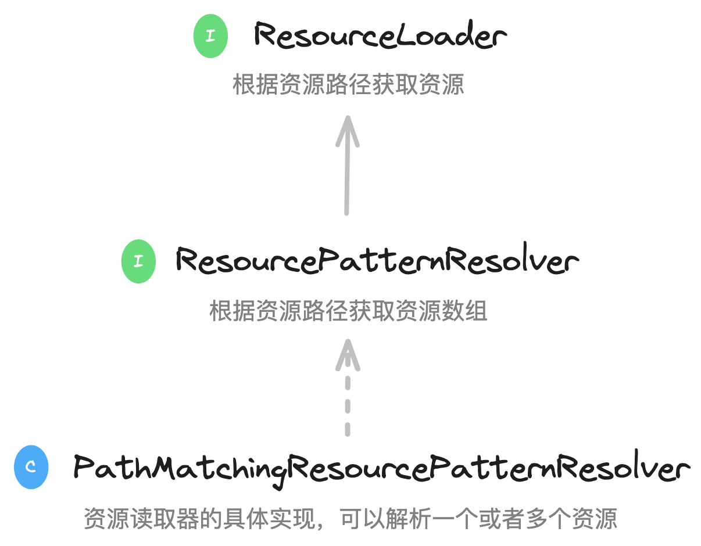
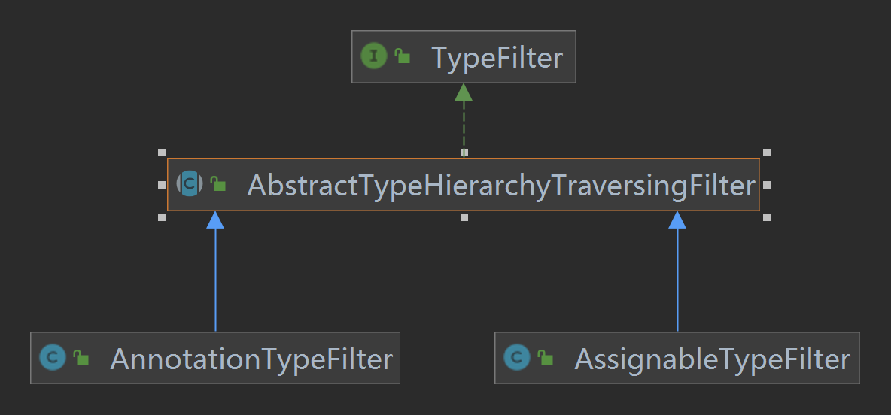

+++
title = "Spring源码BeanDefinition解析之ClassPathBeanDefinitionScanner"
date = "2023-01-19"
description = "Spring BeanDefinition源码解析"
tags = [
    "Spring",
    "BeanDefinition"
]
categories = [
    "Spring"
]
image = "bd.jpg"
draft=false
+++

主要是介绍Spring framework中在解析BeanDefinition时用到的ClassPathBeanDefinitionScanner以及涉及的一些底层API。
<!--more-->

## 前言
在Spring中我们可以通过编程式的方式显示声明定义BeanDefinition：
```java
// 创建一个Spring容器
AnnotationConfigApplicationContext applicationContext = new AnnotationConfigApplicationContext(AppConfig.class);
// 获取容器中名为userService的BeanDefinition
BeanDefinition userService = applicationContext.getBeanDefinition("userService");
System.out.println(userService);
```

## ClassPathBeanDefinitionScanner
### 扫描器是什么
>bean定义扫描解析器用于在classpath下发现候选的bean,使用指定的**BeanFactory**或者**ApplicationContext**注册bean定义`BeanDefinition`。

上面是官方源码中的注释，其实写的很清楚了，扫描器通过入参classpath使用容器进行bean定义的注册，使用相关的filter进行过滤注册，默认过滤器会对包含如下注解的类进行扫描解析:
* `org.springframework.stereotype.Component @Component`
* `org.springframework.stereotype.Repository @Repository`
* `org.springframework.stereotype.Service @Service`
* `org.springframework.stereotype.Con--troller @Controller`

看下相关的构造函数API：
```java
// 构造函数中传入容器
public ClassPathBeanDefinitionScanner(BeanDefinitionRegistry registry) {
        // 使用默认过滤器
        this(registry, true);
}

// 构造函数传入容器和是否使用默认过滤器
public ClassPathBeanDefinitionScanner(BeanDefinitionRegistry registry, boolean useDefaultFilters) {
    this(registry, useDefaultFilters, getOrCreateEnvironment(registry));
}
```
扫描器根据指定的包路径比如在@ComponentScan注解中指定，通过资源解析器`ResourcePatternResolver`扫描该路径下的class文件,最终通过元数据读取器`MetadataReader`解析成一个一个的BeanDefinition注册到容器上下文中去，解析时候可以设置相应的规则filter,比如设置哪些class文件不需要解析又有哪些需要。

### 扫描解析入口方法
Spring上下文容器在扫描时会调用`org.springframework.context.annotation.ClassPathBeanDefinitionScanner#scan`进行解析指定包路径下面的候选
定义，具体Spring是在哪调用该方法进入扫描解析流程的后续再详细分析，本篇专注解析逻辑本身。
```java
public int scan(String... basePackages) {
    // 获取已经扫描的bean定义个数
    int beanCountAtScanStart = this.registry.getBeanDefinitionCount();
    // 开始扫描解析
    doScan(basePackages);
    
    // Register annotation config processors, if necessary.
    if (this.includeAnnotationConfig) {
        AnnotationConfigUtils.registerAnnotationConfigProcessors(this.registry);
    }
    // 计算本次实际扫描解析到的bean定义个数
    return (this.registry.getBeanDefinitionCount() - beanCountAtScanStart);
}
```
scan方法中并没有核心的解析逻辑，只是计算了下本次解析的BeanDefinition个数，具体的解析逻辑位于doScan(basePackages)方法中。

## ResourceLoader
```java
// 读取文件资源
AnnotationConfigApplicationContext ctx = new AnnotationConfigApplicationContext(AppConfig.class);
Resource resource = ctx.getResource("file://D:\\githu\\spring-framework-5.3.10\\tuling\\src\\main\\java\\com\\demo\\service\\UserService.java");
System.out.println(resource.contentLength());
System.out.println(resource.getFilename());

// 读取网络资源
Resource resource1 = ctx.getResource("https://www.baidu.com");
System.out.println(resource1.contentLength());
System.out.println(resource1.getURL());

// 读取类路径资源
Resource resource2 = ctx.getResource("classpath:spring.xml");
System.out.println(resource2.contentLength());
System.out.println(resource2.getURL());
```
Spring中上下文容器AbstractApplicationContext由于继承了`DefaultResourceLoader`，DefaultResourceLoader实现了`ResourceLoader`，所以可以使用容器上下文应对不同的资源路径获取不同的`Resource`。
而在ClassPathBeanDefinitionScanner内部最终则会使用`org.springframework.core.io.support.PathMatchingResourcePatternResolver#getResources`解析包路径下得到文件资源。

 
PathMatchingResourcePatternResolver通过实现ResourcePatternResolver接口最终实现ResourceLoader的能力。

## MetadataReader
在Spring中需要去解析类的信息，比如类名、类中的方法、类上的注解，这些都可以称之为类的元数据，所以Spring中对类的元数据做了抽象，并提供了一些工具类。
MetadataReader表示类的元数据读取器，默认实现类为SimpleMetadataReader。比如：
```java
SimpleMetadataReaderFactory simpleMetadataReaderFactory = new SimpleMetadataReaderFactory();

// 构造一个MetadataReader
MetadataReader metadataReader = simpleMetadataReaderFactory.getMetadataReader("com.demo.service.UserService");

// 得到一个ClassMetadata，并获取了类名
ClassMetadata classMetadata = metadataReader.getClassMetadata();
System.out.println(classMetadata.getClassName());

// 获取一个AnnotationMetadata，并获取类上的注解信息
AnnotationMetadata annotationMetadata = metadataReader.getAnnotationMetadata();
// 类上是否包含@Component注解 可以递归检查
System.out.println(annotationMetadata.hasMetaAnnotation(Component.class.getName()));
for (String annotationType : annotationMetadata.getAnnotationTypes()) {
	System.out.println(annotationType);
}
```
## ExcludeFilter和IncludeFilter
### 如何在Spring中使用filter
这两个过滤器在ClassPathBeanDefinitionScanner扫描出包路径下的所有资源文件后，会使用这2个过滤器看是否符合其规则进一步决定是否要生成BeanDefinition。   
在Spring中用户如何自定义使用过滤器呢，比如下面的配置，表示扫描com.example包下面的类，排除所有标有@ExcludeComponent注解的类不会成为bean,即使这个类上标注有@Component;IncludeComponent类即使没有@Component注解也会被解析。
```java
@Configuration
@ComponentScan(basePackages = "com.example",
        excludeFilters = @ComponentScan.Filter(type = FilterType.ANNOTATION, classes = {ExcludeComponent.class}),
        includeFilters = @ComponentScan.Filter(type = FilterType.ASSIGNABLE_TYPE, classes = {IncludeComponent.class}))
public class AppConfig {
    // 配置类的其他内容
}
```
FilterType分为：
1. ANNOTATION：表示是否包含某个注解
2. ASSIGNABLE_TYPE：表示是否是某个类
3. ASPECTJ：表示否是符合某个Aspectj表达式
4. REGEX：表示是否符合某个正则表达式
5. CUSTOM：自定义
### 哪里使用到filter
解析器具体是在哪里会使用到过滤器呢？下面是Spring中扫描器扫描的入口方法，在`scanCandidateComponents`方法中解析出包路径下的所有文件资源后会遍历进行过滤匹配，符合过滤条件的资源最后才会生成BeanDefinition。
```java
org.springframework.context.annotation.ClassPathScanningCandidateComponentProvider#scanCandidateComponents

private Set<BeanDefinition> scanCandidateComponents(String basePackage) {
    Set<BeanDefinition> candidates = new LinkedHashSet<>();

    // 获取basePackage下所有的文件资源
    String packageSearchPath = ResourcePatternResolver.CLASSPATH_ALL_URL_PREFIX +
        resolveBasePackage(basePackage) + '/' + this.resourcePattern;

    Resource[] resources = getResourcePatternResolver().getResources(packageSearchPath);

    ...
    for (Resource resource : resources) {
            ...
            MetadataReader metadataReader = getMetadataReaderFactory().getMetadataReader(resource);
            // excludeFilters、includeFilters判断
            if (isCandidateComponent(metadataReader)) { // @Component-->includeFilters判断
                ScannedGenericBeanDefinition sbd = new ScannedGenericBeanDefinition(metadataReader);
                sbd.setSource(resource);

                if (isCandidateComponent(sbd)) {
                    ...
                    candidates.add(sbd);
                }
                ...
            }
            ...
    }
    return candidates;
}
```
在isCandidateComponent中具体的过滤匹配逻辑，就是使用excludeFilters和includeFilters过滤器的match方法判断是否满足过滤条件。
```java
protected boolean isCandidateComponent(MetadataReader metadataReader) throws IOException {
    for (TypeFilter tf : this.excludeFilters) {
        if (tf.match(metadataReader, getMetadataReaderFactory())) {
            return false;
        }
    }

    // 符合includeFilters的会进行条件匹配，通过了才是Bean，也就是先看有没有@Component，再看是否符合@Conditional
    for (TypeFilter tf : this.includeFilters) {
        if (tf.match(metadataReader, getMetadataReaderFactory())) {
            return isConditionMatch(metadataReader);
        }
    }
    return false;
}
```
* Spring在创建上下文容器时默认会在扫描器中创建`org.springframework.core.type.filter.AnnotationTypeFilter`类型的includeFilters，默认对含有@Component的组件进行解析匹配
* 而使用了@ComponentScan定义的过滤器最后则会生成`org.springframework.core.type.filter.AssignableTypeFilter`类型的过滤器添加到容器中进行过滤匹配
### TypeFilter
 
在顶层接口TypeFilter中，使用metaData定义了匹配行为规则：
```java
public interface TypeFilter {
    // 过滤器匹配方法
    boolean match(MetadataReader metadataReader, MetadataReaderFactory metadataReaderFactory) throws IOException;
}
```
AnnotationTypeFilter和AssignableTypeFilter都继承了抽象类`org.springframework.core.type.filter.AbstractTypeHierarchyTraversingFilter#macth`方法，本身没有对macth方法做具体的实现，macth方法的主体流程实现则是由抽象类AbstractTypeHierarchyTraversingFilter负责，不同的匹配子逻辑则是交由子类AnnotationTypeFilter和AssignableTypeFilter进行了实现，典型的模板方法设计模式。

```java
org.springframework.core.type.filter.AbstractTypeHierarchyTraversingFilter#match(org.springframework.core.type.classreading.MetadataReader, org.springframework.core.type.classreading.MetadataReaderFactory)

public boolean match(MetadataReader metadataReader, MetadataReaderFactory metadataReaderFactory)
			throws IOException {
    // AnnotationTypeFilter实现macthSelf方法
    // 使用metadataReader判断是否包含指定注解
    if (matchSelf(metadataReader)) {
        return true;
    }
    // AssignableTypeFilter实现了matchClassName方法
    // 匹配类名是否一致
    ClassMetadata metadata = metadataReader.getClassMetadata();
    if (matchClassName(metadata.getClassName())) {
        return true;
    }
    ...
    return false;
}
```
#### AnnotationTypeFilter
```java
// 目标注解类型
private final Class<? extends Annotation> annotationType;

protected boolean matchSelf(MetadataReader metadataReader) {
    // 获取类的元数据
    AnnotationMetadata metadata = metadataReader.getAnnotationMetadata();
    // 判断当前类上是否包含目标注解
    return metadata.hasAnnotation(this.annotationType.getName()) ||
            (this.considerMetaAnnotations && metadata.hasMetaAnnotation(this.annotationType.getName()));
}
```
`AbstractTypeHierarchyTraversingFilter#matchSelf`方法默认返回false,AnnotationTypeFilter重写了matchSelf方法，使用metadataReader获取当前资源的元数据信息判断是否包含目标注解，metadata.hasMetaAnnotation方法会递归地去解析资源上是否包含目标注解。什么意思呢？比如当前类上使用了@Service注解，metadata.hasMetaAnnotation会检查@Service注解里面是否有@Component注解。
#### AssignableTypeFilter
```java
// 目标类名称
private final Class<?> targetType;
// 匹配目标类名称
protected boolean matchClassName(String className) {
		return this.targetType.getName().equals(className);
}
```
`org.springframework.core.type.filter.AssignableTypeFilter#matchClassName`方法比较简单，拿目标类名称与当前资源解析器获取的类名称匹配下，targetType就是在@ComponentScan中注定过滤匹配类型。