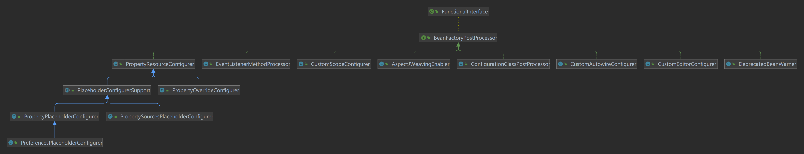
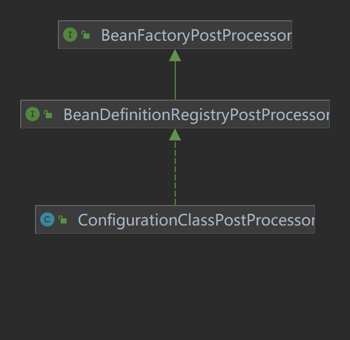
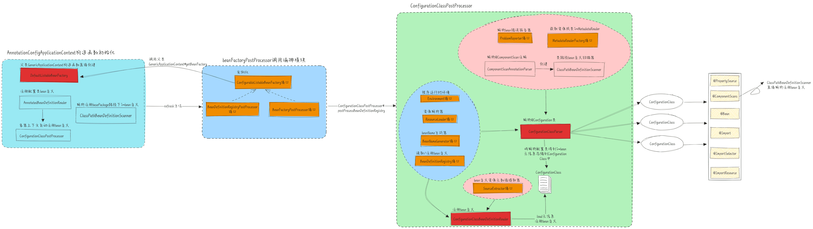
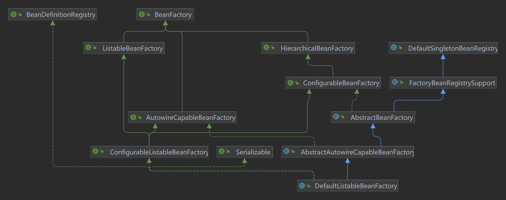
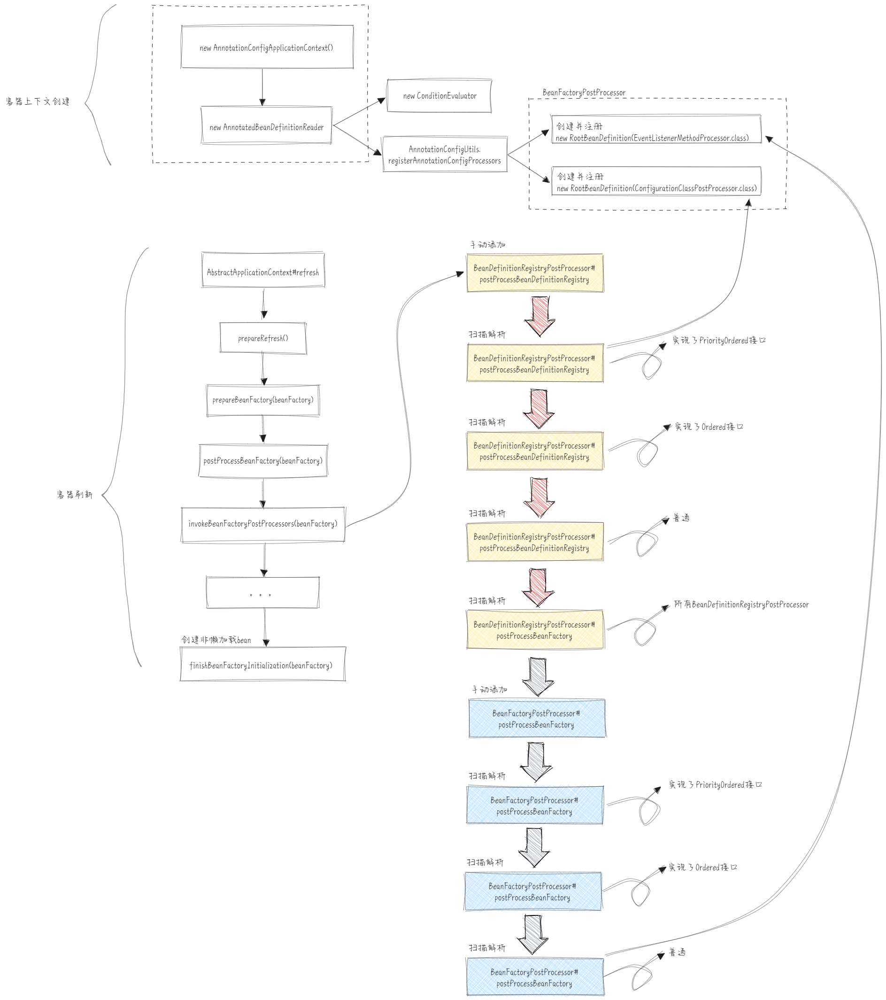
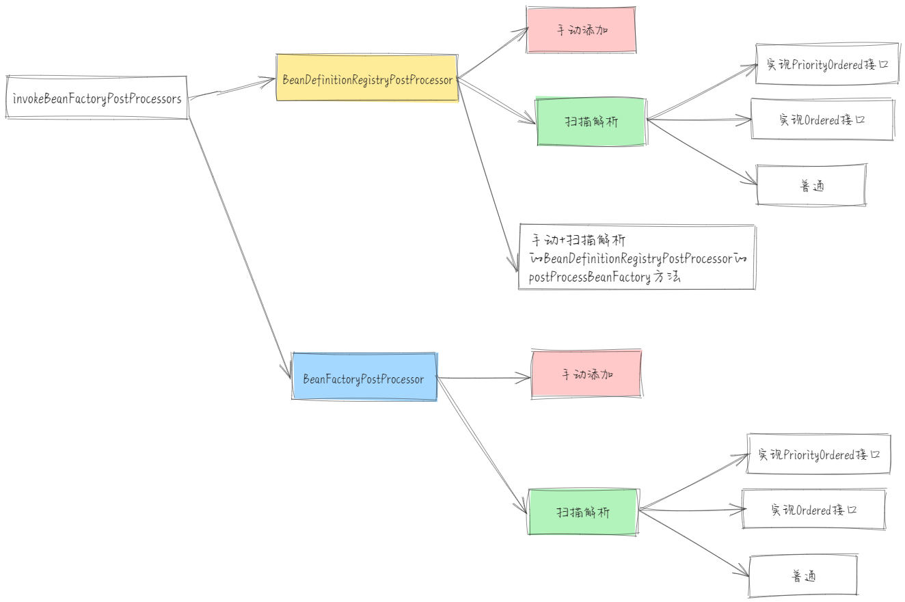

+++
title = "Spring BeanFactoryPostProcessor"
date = "2024-04-08"
description = "Spring BeanDefinition模块BeanFactoryPostProcessor源码解析"
tags = [
    "Spring",
    "BeanDefinition",
    "BeanFactoryPostProcessor"
]
categories = [
    "Spring"
]
image = "bfbakground.png"
draft=false
+++

本篇文章主要是介绍Spring在生成BeanDefinition的过程中，涉及到的扩展接口BeanFactoryPostProcessor以及子接口BeanDefinitionRegistryPostProcessor的介绍、作用以及Spring内部的一些既有实现。
<!--more-->

## BeanFactoryPostProcessor是什么？
>用于对beanFactory进行回调处理，允许用户对应用上下文中的bean定义进行自定义修改，主要通过底层容器beanFactory对bean属性值进行适配处理。
>比如通过用户自定义的外部属性配置文件（主要是.properties）在程序运行时动态的更改Spring容器中bean的属性值，从而提供了一种在配置文件之外修改 bean 属性的机制。
>PropertyResourceConfigurer抽象类就是一个开箱即用的既有实现。

上述官方文档中的说明指明了2件事：
* BeanFactoryPostProcessor提供了一种对beanFactory进行回调处理的机制，作为SPI扩展点
* 通过对beanFactory回调，可以在程序运行时动态处理bean属性值，比如替换被@Value修饰的属性占位符
看下BeanFactoryPostProcessor的接口定义：
```java
org.springframework.beans.factory.config.BeanFactoryPostProcessor

public interface BeanFactoryPostProcessor {

    void postProcessBeanFactory(ConfigurableListableBeanFactory beanFactory) throws BeansException;

}
```
BeanFactoryPostProcessor接口中只有一个定义的方法，入参是ConfigurableListableBeanFactory，通过beanFactory就可以获取指定的beanDefinition，进而修改beanDefinition。BeanFactoryPostProcessor作用的时机应该是所有的bean定义已经被加载了但是还没实例化，此时可以修改属性。<span style="font-weight:bold; font-size:larger;">注意</span>：<span style="color:red; font-style:italic;">ConfigurableListableBeanFactory只具备查询beanDefinition的能力，并不能对beanDefinition增删即进行注册。</span>
### 如何使用
```java
    @Component
    public class User {

        private String name = "test001";

        public  Integer salary;

        // 省略get set方法
        ...
    }

    @Component
    public class SalaryBeanFactoryPostProcessor implements BeanFactoryPostProcessor {
        @Override
        public void postProcessBeanFactory(ConfigurableListableBeanFactory beanFactory) throws BeansException {
            // 获取user的bean定义
            BeanDefinition user = beanFactory.getBeanDefinition("user");
            // 获取user bean定义的属性
            MutablePropertyValues propertyValues = user.getPropertyValues();
            // 对user的属性salary赋值
            propertyValues.add("salary", 1000);
        }
    }

    public static void main(String[] args) {

        // 创建一个Spring容器
        AnnotationConfigApplicationContext applicationContext = new AnnotationConfigApplicationContext(AppConfig.class);
        
        User user = (User) applicationContext.getBean("user");
        System.out.println(user);
    }
```
程序中定义了User用户对象并通过@Component声明为bean，用户对象有个属性salary，现在要对所有用户bean的salary属性统一赋默认值1000。我们就可以使用自定义的SalaryBeanFactoryPostProcessor组件在postProcessBeanFactory方法中进行属性的统一赋值。
## BeanDefinitionRegistryPostProcessor是什么？
>BeanFactoryPostProcessor的SPI扩展，在BeanFactoryPostProcessor开始作用前允许注册beanDefinition。Spring内部提供了相应实现`org.springframework.context.annotation.ConfigurationClassPostProcessor`。

BeanDefinitionRegistryPostProcessor看名字就知道应该是跟bean定义的注册相关的后置处理器。由于BeanFactoryPostProcessor只支持bean定义属性的修改而不支持bean定义的注册，所以相关实现就由BeanDefinitionRegistryPostProcessor接口定义，算是对BeanFactoryPostProcessor的补充。惯例看下相关接口的定义：
```java
org.springframework.beans.factory.support.BeanDefinitionRegistryPostProcessor

public interface BeanDefinitionRegistryPostProcessor extends BeanFactoryPostProcessor {

    void postProcessBeanDefinitionRegistry(BeanDefinitionRegistry registry) throws BeansException;
}
```
`postProcessBeanDefinitionRegistry`方法的入参为BeanDefinitionRegistry，BeanDefinitionRegistry可以对bean定义进行注册、删除、查询。跟BeanFactoryPostProcessor的作用时机一样也是在所有bean定义被加载还未被实例化之前，而且会比`BeanFactoryPostProcessor#postProcessBeanFactory`优先作用。

### 如何使用
```java
public class User {

    private String name = "test001";

    public  Integer salary;
}

@Component
public class AddUserBeanDefinitionRegistryPostProcessor implements BeanDefinitionRegistryPostProcessor {

    @Override
    public void postProcessBeanFactory(ConfigurableListableBeanFactory beanFactory) throws BeansException {

    }

    @Override
    public void postProcessBeanDefinitionRegistry(BeanDefinitionRegistry registry) throws BeansException {
        // 创建User bean定义
        RootBeanDefinition userBeanDefinition = new RootBeanDefinition(User.class);
        // 设置属性
        MutablePropertyValues propertyValues = userBeanDefinition.getPropertyValues();
        propertyValues.addPropertyValue("name", "test002");
        propertyValues.addPropertyValue("salary", 1000);
        // 注册bean定义
        registry.registerBeanDefinition("user", userBeanDefinition);
    }
}

public static void main(String[] args) {

    // 创建一个Spring容器
    AnnotationConfigApplicationContext applicationContext = new AnnotationConfigApplicationContext(AppConfig.class);

    User user = (User) applicationContext.getBean("user");
    System.out.println(user);
    /*UserService userService = (UserService) applicationContext.getBean("user");
    userService.test();*/
}
```
自定义AddUserBeanDefinitionRegistryPostProcessor实现了BeanDefinitionRegistryPostProcessor接口，在`postProcessBeanDefinitionRegistry`方法中手动编程式的创建了User类的bean定义并进行了属性的赋值，最后调用BeanDefinitionRegistry注册到容器中去。最后使用applicationContext通过beanName可以获取到User类型的bean。
## Spring内部实现
### BeanFactoryPostProcessor实现
 
* PropertyResourceConfigurer：主要进行属性值的替换，包括了子类PropertyOverrideConfigurer在外部属性文件.properties中通过beanName.property=value这种kv的形式定义需要覆盖的bean属性达到替换bean属性值的目的；PlaceholderConfigurerSupport用于从外部配置中读取属性文件中的占位符定义（${...}），并在容器启动时将其替换为实际的值。
* ConfigurationClassPostProcessor: // TODO
* EventListenerMethodProcessor：用于处理Spring应用程序上下文中的事件监听方法。主要作用是扫描Spring容器中的Bean，查找其中标注了事件监听注解（`@EventListener`）的方法，并将其注册为事件监听器。当事件发生时，Spring将会调用这些注册的事件监听方法。
* CustomScopeConfigurer：于配置自定义的作用域（Scope）。
* AspectJWeavingEnabler：用于启用AspectJ编织（weaving）功能。
* CustomAutowireConfigurer ：用于配置自定义的自动装配规则
* CustomEditorConfigurer ：用于配置自定义的属性编辑器（PropertyEditor）。属性编辑器用于将字符串值转换为特定类型的对象，或将对象转换为字符串值。配置了自定义属性编辑器，Spring就会在容器启动时注册自定义的属性编辑器，从而影响属性值的转换行为。这样，在进行属性注入时，Spring 将会使用注册的自定义属性编辑器来进行类型转换。
### BeanDefinitionRegistryPostProcessor实现
    
&ensp;&ensp;&ensp;&ensp;BeanDefinitionRegistryPostProcessor在Spring内部的实现只有ConfigurationClassPostProcessor，同时ConfigurationClassPostProcessor还继承了BeanFactoryPostProcessor接口。   
&ensp;&ensp;&ensp;&ensp;ConfigurationClassPostProcessor实现BeanDefinitionRegistryPostProcessor，主要进行解析配置类，通过配置类进一步解析得到所有的bean定义，扫描含有@ComponentScan、 @Import、@ImportResource、@Bean、@PropertySource等注解的bean定义。可以说`ConfigurationClassPostProcessor#postProcessBeanDefinitionRegistry`非常重要，bean定义的扫描解析的入口就是在这了。
## Spring在何时调用BeanFactoryPostProcessor和BeanDefinitionRegistryPostProcessor？
&ensp;&ensp;&ensp;&ensp;上面介绍了这两个接口是干什么的以及内部的一些既有实现。那么还有最后一个问题，就是Spring是在何时使用这些SPI接口的呢？或者说在上下文容器的生命周期的哪个环节起作用的呢？并且这两个接口都是跟beanDefinition是相关的，那么他们的先后作用顺序又是怎样的呢？   
&ensp;&ensp;&ensp;&ensp;由于这两个接口的实现比较多，本篇文章选取ConfigurationClassPostProcessor这个共有的实现类作为源码分析对象，因为ConfigurationClassPostProcessor也是后续bean定义扫描解析的入口。   



&ensp;&ensp;&ensp;&ensp;上面是ConfigurationClassPostProcessor从创建到使用的整个流程。大致可以分为三个阶段，青色部分为容器上下文为创建ConfigurationClassPostProcessor的准备阶段，此阶段主要是预先注册ConfigurationClassPostProcessor的bean定义以及准备后续会使用到的BeanFactory；蓝色部分为一阶段注册的BeanFactoryPostProcessor和BeanDefinitionRegistryPostProcessor的实例化以及编排调用；三阶段就是具体的postProcessBeanDefinitionRegistry的执行，此处选取了ConfigurationClassPostProcessor，主要就是进行各种BeanDefinition的解析了。

### BeanFactoryPostProcessor创建准备

&ensp;&ensp;&ensp;&ensp;在Spring中，万物都是Bean，用户创建的自定义类是bean，Spring基础组件也是bean。既然是bean，那么都会经过IOC被创建后使用，也就会需要进行相应的BeanDefinition注册。
1. 对于像BeanFactoryPostProcessor这种基础组件，Spring会在容器上下文初始化时预先编程式注册对应的bean定义。
2. BeanFactoryPostProcessor和BeanDefinitionRegistryPostProcessor的两个方法中需要用到`BeanFactory`和`BeanDefinitionRegistry`，所以在初始化时也就需要创建相应的组件供其后续使用。

&ensp;&ensp;&ensp;&ensp;上述两个步骤是在哪里实现的呢？看一下容器上下文`AnnotationConfigApplicationContext`的构造函数源码便可知。
```java
org.springframework.context.support.GenericApplicationContext

// 父类GenericApplicationContext无参构造函数
public GenericApplicationContext() {
    this.beanFactory = new DefaultListableBeanFactory();
}

org.springframework.context.annotation.AnnotationConfigApplicationContext

// 无参构造函数
public AnnotationConfigApplicationContext() {
    // 额外会创建StandardEnvironment
    this.reader = new AnnotatedBeanDefinitionReader(this);
    createAnnotatedBeanDefReader.end();
    this.scanner = new ClassPathBeanDefinitionScanner(this);
}

// 使用自定义的BeanFactory初始化AnnotationConfigApplicationContext
public AnnotationConfigApplicationContext(DefaultListableBeanFactory beanFactory) {
    // 调用父类GenericApplicationContext的有参构造函数初始化beanFactory
    super(beanFactory);
    this.reader = new AnnotatedBeanDefinitionReader(this);
    this.scanner = new ClassPathBeanDefinitionScanner(this);
}

// 使用自定义组件类即组件配置类（含有@Configuration注解的类、含有@ComponentScan的类）初始化
public AnnotationConfigApplicationContext(Class<?>... componentClasses) {
    // 调用无参构造函数
    // 构造DefaultListableBeanFactory、AnnotatedBeanDefinitionReader、ClassPathBeanDefinitionScanner
    this();
    // 注册组件类即注册配置类
    register(componentClasses);
    // 刷新容器
    refresh();
}

// 使用类路径（路径下用户自定义bean）初始化
public AnnotationConfigApplicationContext(String... basePackages) {
    this();
    scan(basePackages);
    refresh();
}


```
&ensp;&ensp;&ensp;&ensp;可以看到AnnotationConfigApplicationContext的构造函数有很多，有参数的可以使用自定义`BeanFactory`、自定义的配置类、直接指定要扫描的类路径。但是这些构造函数中都会直接或间接的创建`AnnotatedBeanDefinitionReader`、`ClassPathBeanDefinitionScanner`，还有一个隐性的操作就是重载`AnnotationConfigApplicationContext`无参构造函数初始化的同时也会调用父类`GenericApplicationContext`的无参构造函数创建一个`DefaultListableBeanFactory`的beanFactory。这个DefaultListableBeanFactory是干什么用的？


&ensp;&ensp;&ensp;&ensp;DefaultListableBeanFactory的顶层接口有`BeanFactory`和`BeanDefinitionRegistry`，这就是后续`BeanFactoryPostProcessor`和`BeanDefinitionRegistryPostProcessor`接口方法中需要用到的组件，在`GenericApplicationContext`的无参构造函数中进行了初始化创建。
继续深入分析`AnnotatedBeanDefinitionReader`的源码：
```java
// 使用AnnotationConfigApplicationContext作为registry传入
public AnnotatedBeanDefinitionReader(BeanDefinitionRegistry registry) {
    this(registry, getOrCreateEnvironment(registry));
}

public AnnotatedBeanDefinitionReader(BeanDefinitionRegistry registry, Environment environment) {
   
    this.registry = registry;
    // 用来解析@Conditional注解的
    this.conditionEvaluator = new ConditionEvaluator(registry, environment, null);
    // 使用registry注册所有注解相关的后置处理器bean定义
    AnnotationConfigUtils.registerAnnotationConfigProcessors(this.registry);
}

org.springframework.context.annotation.AnnotationConfigUtils

public static Set<BeanDefinitionHolder> registerAnnotationConfigProcessors(
			BeanDefinitionRegistry registry, @Nullable Object source) {

    DefaultListableBeanFactory beanFactory = unwrapDefaultListableBeanFactory(registry);
    if (beanFactory != null) {

        // 设置beanFactory的OrderComparator为AnnotationAwareOrderComparator
        // 它是一个Comparator，是一个比较器，可以用来进行排序，比如new ArrayList<>().sort(Comparator);
        if (!(beanFactory.getDependencyComparator() instanceof AnnotationAwareOrderComparator)) {
            beanFactory.setDependencyComparator(AnnotationAwareOrderComparator.INSTANCE);
        }
        // 用来判断某个Bean能不能用来进行依赖注入
        if (!(beanFactory.getAutowireCandidateResolver() instanceof ContextAnnotationAutowireCandidateResolver)) {
            beanFactory.setAutowireCandidateResolver(new ContextAnnotationAutowireCandidateResolver());
        }
    }

    Set<BeanDefinitionHolder> beanDefs = new LinkedHashSet<>(8);

    // 注册ConfigurationClassPostProcessor类型的BeanDefinition
    if (!registry.containsBeanDefinition(CONFIGURATION_ANNOTATION_PROCESSOR_BEAN_NAME)) {
        RootBeanDefinition def = new RootBeanDefinition(ConfigurationClassPostProcessor.class);
        def.setSource(source);
        beanDefs.add(registerPostProcessor(registry, def, CONFIGURATION_ANNOTATION_PROCESSOR_BEAN_NAME));
    }

    // 注册AutowiredAnnotationBeanPostProcessor类型的BeanDefinition
    if (!registry.containsBeanDefinition(AUTOWIRED_ANNOTATION_PROCESSOR_BEAN_NAME)) {
        RootBeanDefinition def = new RootBeanDefinition(AutowiredAnnotationBeanPostProcessor.class);
        def.setSource(source);
        beanDefs.add(registerPostProcessor(registry, def, AUTOWIRED_ANNOTATION_PROCESSOR_BEAN_NAME));
    }

    // 注册CommonAnnotationBeanPostProcessor类型的BeanDefinition
    if (jsr250Present && !registry.containsBeanDefinition(COMMON_ANNOTATION_PROCESSOR_BEAN_NAME)) {
        RootBeanDefinition def = new RootBeanDefinition(CommonAnnotationBeanPostProcessor.class);
        def.setSource(source);
        beanDefs.add(registerPostProcessor(registry, def, COMMON_ANNOTATION_PROCESSOR_BEAN_NAME));
    }

    // 注册PersistenceAnnotationBeanPostProcessor类型的BeanDefinition
    if (jpaPresent && !registry.containsBeanDefinition(PERSISTENCE_ANNOTATION_PROCESSOR_BEAN_NAME)) {
        RootBeanDefinition def = new RootBeanDefinition();
        try {
            def.setBeanClass(ClassUtils.forName(PERSISTENCE_ANNOTATION_PROCESSOR_CLASS_NAME,
                    AnnotationConfigUtils.class.getClassLoader()));
        }
        catch (ClassNotFoundException ex) {
            throw new IllegalStateException(
                    "Cannot load optional framework class: " + PERSISTENCE_ANNOTATION_PROCESSOR_CLASS_NAME, ex);
        }
        def.setSource(source);
        beanDefs.add(registerPostProcessor(registry, def, PERSISTENCE_ANNOTATION_PROCESSOR_BEAN_NAME));
    }

    // 注册EventListenerMethodProcessor类型的BeanDefinition，用来处理@EventListener注解的
    if (!registry.containsBeanDefinition(EVENT_LISTENER_PROCESSOR_BEAN_NAME)) {
        RootBeanDefinition def = new RootBeanDefinition(EventListenerMethodProcessor.class);
        def.setSource(source);
        beanDefs.add(registerPostProcessor(registry, def, EVENT_LISTENER_PROCESSOR_BEAN_NAME));
    }

    // 注册DefaultEventListenerFactory类型的BeanDefinition，用来处理@EventListener注解的
    if (!registry.containsBeanDefinition(EVENT_LISTENER_FACTORY_BEAN_NAME)) {
        RootBeanDefinition def = new RootBeanDefinition(DefaultEventListenerFactory.class);
        def.setSource(source);
        beanDefs.add(registerPostProcessor(registry, def, EVENT_LISTENER_FACTORY_BEAN_NAME));
    }

    return beanDefs;
}
```
&ensp;&ensp;&ensp;&ensp;一路分析AnnotatedBeanDefinitionReader的源码发现，在AnnotatedBeanDefinitionReader的创建过程中，最终会调用org.springframework.context.annotation.AnnotationConfigUtils#registerAnnotationConfigProcessors注册各种的后置处理器bean定义，这些后置处理器都是作为Spring的基础组件提供后续服务的。其中就包含BeanFactoryPostProcessor相关的ConfigurationClassPostProcessor和EventListenerMethodProcessor两个实现。

&ensp;&ensp;&ensp;&ensp;第25-27行中，beanFactory手动注册了Comparator实例`AnnotationAwareOrderComparator`用于后续编排BeanFactoryPostProcessor实现时进行排序，`AnnotationAwareOrderComparator`继承了`OrderComparator`，相关用法和源码解析在[Spring源码BeanDefinition解析之ClassPathBeanDefinitionScanner]()一文中OrderComparator章节已经介绍过了。
### BeanFactoryPostProcessor调用编排

&ensp;&ensp;&ensp;&ensp;BeanDefinitionRegistryPostProcessor接口继承了BeanFactoryPostProcessor接口，本质上也是BeanFactoryPostProcessor。那么如果程序中同时出现这两种接口的实现，这2种类型的接口实现优先级顺序如何定义呢？每一种类型的接口实现中如果有的实现了`PriorityOrdered`接口，有的实现了`Ordered`接口那么优先级又如何定义呢？同时Spring中这2种类型的接口实现有的是通过编程式用户手动添加注册、有的是通过@Component注解声明式定义的那么优先级顺序又如何定义呢？本质上来说针对BeanFactoryPostProcessor及其子接口的实现Spring需要从添加方式、接口类型、接口优先级这三个维度进行执行顺序的编排！这里先直接给出结论，再进行源码解析。



&ensp;&ensp;&ensp;&ensp;执行顺序的源码如上图所示，源码位于org.springframework.context.support.PostProcessorRegistrationDelegate#invokeBeanFactoryPostProcessors方法中。整体执行流程在实例化bean之前。
```java
public static void invokeBeanFactoryPostProcessors(
			ConfigurableListableBeanFactory beanFactory, List<BeanFactoryPostProcessor> beanFactoryPostProcessors) {   // BeanFactoryPostProcessor、BeanDefinitionRegistryPostProcessor

    // Invoke BeanDefinitionRegistryPostProcessors first, if any.
    Set<String> processedBeans = new HashSet<>();

    if (beanFactory instanceof BeanDefinitionRegistry) {
        BeanDefinitionRegistry registry = (BeanDefinitionRegistry) beanFactory;
        List<BeanFactoryPostProcessor> regularPostProcessors = new ArrayList<>();
        List<BeanDefinitionRegistryPostProcessor> registryProcessors = new ArrayList<>();

        // beanFactoryPostProcessors集合一般情况下都是空的，除非我们手动调用容器的addBeanFactoryPostProcessor方法添加了
        // beanFactoryPostProcessors中可能包含了：普通BeanFactoryPostProcessor对象和BeanDefinitionRegistryPostProcessor对象
        // 对于BeanDefinitionRegistryPostProcessor对象，会执行自己的postProcessBeanDefinitionRegistry()方法
        for (BeanFactoryPostProcessor postProcessor : beanFactoryPostProcessors) {
            if (postProcessor instanceof BeanDefinitionRegistryPostProcessor) {
                BeanDefinitionRegistryPostProcessor registryProcessor =
                        (BeanDefinitionRegistryPostProcessor) postProcessor;
                registryProcessor.postProcessBeanDefinitionRegistry(registry);
                registryProcessors.add(registryProcessor);
            }
            else {
                regularPostProcessors.add(postProcessor);
            }
        }

        // Do not initialize FactoryBeans here: We need to leave all regular beans
        // uninitialized to let the bean factory post-processors apply to them!
        // Separate between BeanDefinitionRegistryPostProcessors that implement
        // PriorityOrdered, Ordered, and the rest.
        List<BeanDefinitionRegistryPostProcessor> currentRegistryProcessors = new ArrayList<>();

        // 执行扫描出来的BeanDefinitionRegistryPostProcessor

        // First, invoke the BeanDefinitionRegistryPostProcessors that implement PriorityOrdered.
        String[] postProcessorNames =
                beanFactory.getBeanNamesForType(BeanDefinitionRegistryPostProcessor.class, true, false);
        for (String ppName : postProcessorNames) {
            if (beanFactory.isTypeMatch(ppName, PriorityOrdered.class)) {
                currentRegistryProcessors.add(beanFactory.getBean(ppName, BeanDefinitionRegistryPostProcessor.class));
                processedBeans.add(ppName);
            }
        }
        // 升序排序
        sortPostProcessors(currentRegistryProcessors, beanFactory);
        registryProcessors.addAll(currentRegistryProcessors);
        invokeBeanDefinitionRegistryPostProcessors(currentRegistryProcessors, registry, beanFactory.getApplicationStartup());
        currentRegistryProcessors.clear();

        // Next, invoke the BeanDefinitionRegistryPostProcessors that implement Ordered.
        postProcessorNames = beanFactory.getBeanNamesForType(BeanDefinitionRegistryPostProcessor.class, true, false);
        for (String ppName : postProcessorNames) {
            // processedBeans表示该beanFactoryPostProcessor的postProcessBeanDefinitionRegistry()方法已经执行过了，不再重复执行
            if (!processedBeans.contains(ppName) && beanFactory.isTypeMatch(ppName, Ordered.class)) {
                currentRegistryProcessors.add(beanFactory.getBean(ppName, BeanDefinitionRegistryPostProcessor.class));
                processedBeans.add(ppName);
            }
        }
        sortPostProcessors(currentRegistryProcessors, beanFactory);
        registryProcessors.addAll(currentRegistryProcessors);
        invokeBeanDefinitionRegistryPostProcessors(currentRegistryProcessors, registry, beanFactory.getApplicationStartup());
        currentRegistryProcessors.clear();

        // Finally, invoke all other BeanDefinitionRegistryPostProcessors until no further ones appear.
        // 执行哪些没有实现了PriorityOrdered或Ordered接口的普通BeanDefinitionRegistryPostProcessor的postProcessBeanDefinitionRegistry()方法
        // 在这个过程中可能会向BeanFactory中注册另外的BeanDefinitionRegistryPostProcessor，所以需要while，直到确定所有的BeanDefinitionRegistryPostProcessor都执行完了
        // 在这个过程中注册的BeanDefinitionRegistryPostProcessor，所实现的PriorityOrdered或Ordered接口可能会不按顺序执行
        // 比如 A注册了B和C,B又注册了D和E,那么B和C会按顺序执行，D和E也会按顺序执行，但是B、C、D、E整体不能保证是顺序执行
        boolean reiterate = true;
        while (reiterate) {
            reiterate = false;
            postProcessorNames = beanFactory.getBeanNamesForType(BeanDefinitionRegistryPostProcessor.class, true, false);
            for (String ppName : postProcessorNames) {
                if (!processedBeans.contains(ppName)) {
                    currentRegistryProcessors.add(beanFactory.getBean(ppName, BeanDefinitionRegistryPostProcessor.class));
                    processedBeans.add(ppName);
                    reiterate = true;
                }
            }
            sortPostProcessors(currentRegistryProcessors, beanFactory);
            registryProcessors.addAll(currentRegistryProcessors);
            invokeBeanDefinitionRegistryPostProcessors(currentRegistryProcessors, registry, beanFactory.getApplicationStartup());
            currentRegistryProcessors.clear();
        }

        // Now, invoke the postProcessBeanFactory callback of all processors handled so far.
        // 执行完BeanDefinitionRegistryPostProcessor的postProcessBeanDefinitionRegistry()方法后，
        // 再执行BeanDefinitionRegistryPostProcessor的postProcessBeanFactory()方法
        invokeBeanFactoryPostProcessors(registryProcessors, beanFactory);

        // 执行手动添加的普通BeanFactoryPostProcessor的postProcessBeanFactory()方法
        invokeBeanFactoryPostProcessors(regularPostProcessors, beanFactory);
    }

    else {
        // Invoke factory processors registered with the context instance.
        invokeBeanFactoryPostProcessors(beanFactoryPostProcessors, beanFactory);
    }

    // 执行扫描出来的普通BeanFactoryPostProcessor

    // Do not initialize FactoryBeans here: We need to leave all regular beans
    // uninitialized to let the bean factory post-processors apply to them!
    String[] postProcessorNames =
            beanFactory.getBeanNamesForType(BeanFactoryPostProcessor.class, true, false);

    // Separate between BeanFactoryPostProcessors that implement PriorityOrdered,
    // Ordered, and the rest.
    List<BeanFactoryPostProcessor> priorityOrderedPostProcessors = new ArrayList<>();
    List<String> orderedPostProcessorNames = new ArrayList<>();
    List<String> nonOrderedPostProcessorNames = new ArrayList<>();
    // 先进行分类
    for (String ppName : postProcessorNames) {
        if (processedBeans.contains(ppName)) {
            // skip - already processed in first phase above
        }
        else if (beanFactory.isTypeMatch(ppName, PriorityOrdered.class)) {
            priorityOrderedPostProcessors.add(beanFactory.getBean(ppName, BeanFactoryPostProcessor.class));
        }
        else if (beanFactory.isTypeMatch(ppName, Ordered.class)) {
            orderedPostProcessorNames.add(ppName);
        }
        else {
            nonOrderedPostProcessorNames.add(ppName);
        }
    }

    // First, invoke the BeanFactoryPostProcessors that implement PriorityOrdered.
    sortPostProcessors(priorityOrderedPostProcessors, beanFactory);
    invokeBeanFactoryPostProcessors(priorityOrderedPostProcessors, beanFactory);

    // Next, invoke the BeanFactoryPostProcessors that implement Ordered.
    List<BeanFactoryPostProcessor> orderedPostProcessors = new ArrayList<>(orderedPostProcessorNames.size());
    for (String postProcessorName : orderedPostProcessorNames) {
        orderedPostProcessors.add(beanFactory.getBean(postProcessorName, BeanFactoryPostProcessor.class));
    }
    sortPostProcessors(orderedPostProcessors, beanFactory);
    invokeBeanFactoryPostProcessors(orderedPostProcessors, beanFactory);

    // Finally, invoke all other BeanFactoryPostProcessors.
    List<BeanFactoryPostProcessor> nonOrderedPostProcessors = new ArrayList<>(nonOrderedPostProcessorNames.size());
    for (String postProcessorName : nonOrderedPostProcessorNames) {
        nonOrderedPostProcessors.add(beanFactory.getBean(postProcessorName, BeanFactoryPostProcessor.class));
    }
    invokeBeanFactoryPostProcessors(nonOrderedPostProcessors, beanFactory);

    // Clear cached merged bean definitions since the post-processors might have
    // modified the original metadata, e.g. replacing placeholders in values...
    beanFactory.clearMetadataCache();
}
```
* 第7-25行：优先执行编程式手动添加的BeanDefinitionRegistryPostProcessor实现，同时筛选出手动添加的BeanFactoryPostProcessor实现供后续执行。
* 第31-48行：执行扫描出的BeanDefinitionRegistryPostProcessor类型的实现了PriorityOrdered接口的实现的postProcessBeanDefinitionRegistry方法。这部分功能通过BeanFactory查找、实例化实现。
* 第51-62行：执行扫描出的BeanDefinitionRegistryPostProcessor类型的实现了Ordered接口的实现的postProcessBeanDefinitionRegistry方法。
* 第69-83行：执行未继承任何优先级顺序接口的普通BeanDefinitionRegistryPostProcessor的postProcessBeanDefinitionRegistry方法。如果在执行postProcessBeanDefinitionRegistry方法时又注册了BeanDefinitionRegistryPostProcessor的Bean定义，那么会迭代继续获取BeanDefinitionRegistryPostProcessor实现并执行postProcessBeanDefinitionRegistry方法，直到最后容器中找不到BeanDefinitionRegistryPostProcessor或者找到的BeanDefinitionRegistryPostProcessor已经都被执行过了才停止。
* 第89行：由于BeanDefinitionRegistryPostProcessor类型的实现也继承了BeanFactoryPostProcessor接口，所以前面手动显示注册的BeanDefinitionRegistryPostProcessor实现和声明式注册的BeanDefinitionRegistryPostProcessor实现最后会被调用执行其postProcessBeanFactory方法。至此所有手动或自动添加的BeanDefinitionRegistryPostProcessor的实现的所有方法都已经被实现。
* 第92-97行：执行手动添加的BeanFactoryPostProcessor实现的postProcessBeanFactory方法。
* 第104-126行：扫描BeanFactoryPostProcessor的实现按PriorityOrdered、Ordered、未继承优先级顺序接口分类。
* 第129-149行：一次执行分类的BeanFactoryPostProcessor实现。

&ensp;&ensp;&ensp;&ensp;整个invokeBeanFactoryPostProcessors方法的逻辑还是比较简单清晰的，首先Spring根据接口类型进行优先级分类，先执行BeanDefinitionRegistryPostProcessor相关实现的所有方法，再实现BeanFactoryPostProcessor实现的方法；接着对于每一类接口，都是优先执行手动编程式添加的组件，然后再执行声明式添加的组件；对于声明式方法添加的组件，再根据优先级接口顺序决定执行先后顺序。


